# ArUco Indoor Localizer & Navigation

> **ArUco fiducial marker + PnP 기반의 비학습식 실내 위치추정 및 길안내 시스템**

> [!NOTE]
> P11은 이동 전/후 두 버전이 있습니다. Git 브랜치별로 좌표를 고정해 사용합니다.


## 한눈에 보기

| 구분 | 현재 구현 |
|---|---|
| 위치추정 | ArUco + `solvePnP` |
| 학습 모델 | **사용하지 않음** |
| 좌표 단위 | mm |
| 출력 위치 | 카메라 광학 중심의 `X / Y / Z` |
| 방향 | Camera Yaw |
| 다중 마커 | 이상치 제거 + 가중 융합 |
| 위치 안정화 | Median + EMA + 급격한 튐 거부 |
| 라이브 UI | 웹캠 / 미니맵 / Navigation Control 3개 창 |
| 네비게이션 경로 | 앞문 → 4번 강의실 → 2번 강의실 → 뒷문 |
| 경유/도착 판정 | 해당 지점 중심 **2.5m 이내** |
| 영상/이미지 분석 | Video / Single Image / Batch Images |
| 결과 저장 | CSV / JSON / MP4 / PNG / HTML |

---

## 시스템 전체 구조

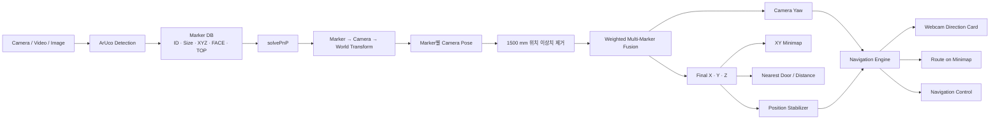

### 처리 핵심

```text
ArUco 검출
→ PnP
→ 월드 좌표 변환
→ 다중 마커 융합
→ 위치 안정화
→ 현재 위치 / 시선 방향
→ 미니맵 + 네비게이션
```

---

## 현재 UI

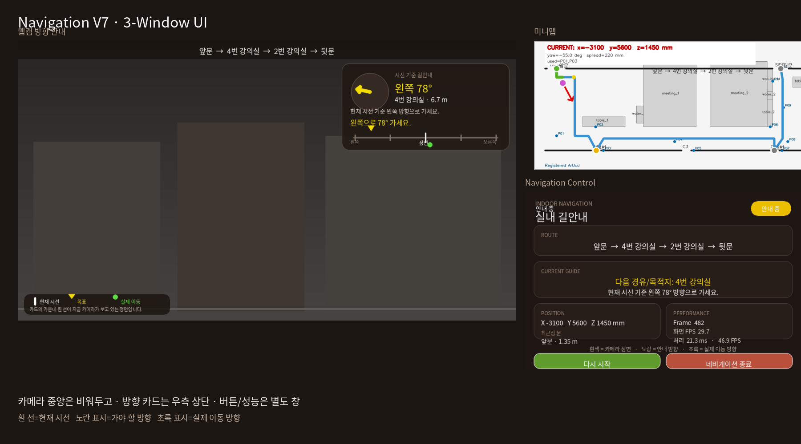

| 창 | 목적 | 주요 표시 |
|---|---|---|
| **ArUco Indoor Navigation** | 실제 환경 확인 + 방향 안내 | 웹캠, 마커, 시선 기준 방향 카드, 경고 |
| **Indoor Navigation Map** | 공간/경로 확인 | 전체 경로, 지나온 길, 현재 위치, 경유지 |
| **Navigation Control** | 조작 + 상태 확인 | 시작/종료, XYZ, 최근접 문, FPS, 처리시간 |

### 방향 아이콘

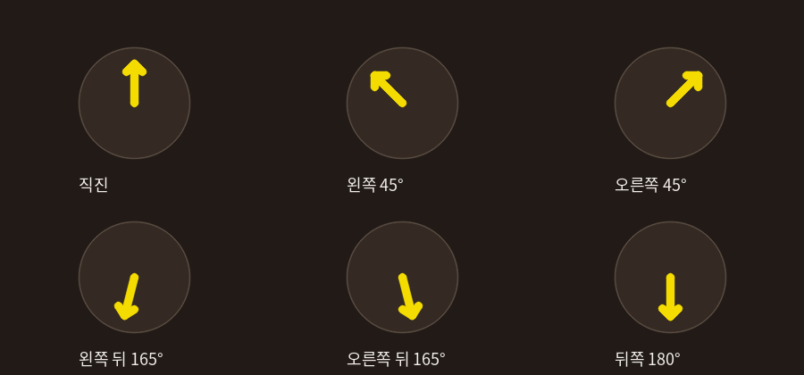

> 둥근 화살표와 U턴 화살표는 사용하지 않습니다.  
> 모든 방향은 **직선 화살표**로 표시합니다.

---

# 빠른 실행

| 목적 | 명령 |
|---|---|
| 실시간 위치추정 | `python webcam_localizer.py --camera 1` |
| 실시간 네비게이션 | `python navigation_live.py --camera 1` |
| 카메라 목록 | `python navigation_live.py --list-cameras` |
| 카메라 캘리브레이션 | `python calibrate_webcam.py --camera 1` |
| 영상 분석 | `python video_localizer.py test.mp4 --preview` |
| 불명 카메라 영상 | `python video_localizer.py test.mp4 --no-calibration --preview` |
| 단일 이미지 | `python image_localizer.py test.jpg --preview` |
| 이미지 일괄 판정 | `python batch_image_localizer.py "C:\이미지폴더" --no-calibration` |
| 결과 비교 | `python compare_localization_results.py test_results\positions.csv` |

필수 패키지:

```powershell
python -m pip install numpy opencv-contrib-python pillow
```

---

# 1. 좌표계

모든 좌표는 **mm**입니다.

| 축 | 의미 |
|---|---|
| `+X` | 평면도 오른쪽 |
| `-X` | 평면도 왼쪽 |
| `+Y` | 평면도 위쪽 |
| `-Y` | 평면도 아래쪽 |
| `+Z` | 바닥 → 천장 |
| `-Z` | 천장 → 바닥 |

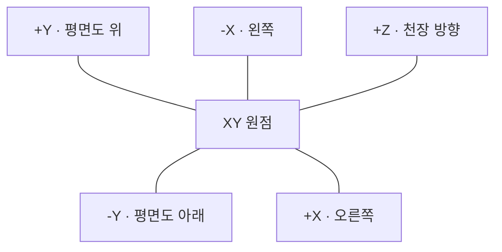

> `X/Y`는 바닥 평면, `Z`는 높이입니다.

---

# 2. 지도 주요 좌표

## 문 / 랜드마크

| 이름 | 중심 좌표 `(x, y)` mm | 비고 |
|---|---:|---|
| 앞문 | `(-3760, 6792)` | 상단 벽 개구부 |
| 4번 강의실 | `(500, 0)` | 하단 벽 |
| 3번 강의실 | `(10180, 0)` | 하단 벽 |
| 2번 강의실 | `(19640, 0)` | 하단 벽 |
| 뒷문 | `(20306, 6792)` | 현재 기존 `쪽문` 좌표 사용 |

## 주요 구조물

| 구조물 | X 범위 mm | Y 범위 mm |
|---|---:|---:|
| TABLE1 | `-940 ~ 3620` | `1962 ~ 2862` |
| 정수기 1 | `4832 ~ 5610` | `2282 ~ 3710` |
| 회의실 1 | `5610 ~ 11250` | `1962 ~ 7370` |
| 회의실 2 | `12725 ~ 18875` | `1962 ~ 7380` |
| TABLE2 | `18875 ~ 19475` | `1962 ~ 4262` |
| 정수기 2 | `18875 ~ 19475` | `4262 ~ 4902` |
| 벽 블록 | `18875 ~ 19475` | `4902 ~ 6792` |
| TABLE3 | `21607 ~ 23707` | `5252 ~ 6125` |

## 벽 개구부

| 벽 | 개구부 |
|---|---|
| `y = 0` | 4번 강의실 `x=0~1000`, 3번 `9680~10680`, 2번 `19140~20140` |
| `y = 6792` | 앞문 `-4760~-2760`, 뒷문/쪽문 `19475~21137` |
| 동쪽 벽 | `x = 27660` |

---

# 3. ArUco Marker Database

마커 로컬축:

```text
local +X = RIGHT
local +Y = TOP
local +Z = FACE

RIGHT = TOP × FACE
```

| Point | ID | Size mm | XYZ mm | FACE | TOP |
|---|---:|---:|---|---|---|
| P01 | 25 | 134 | `(-3760, 1240, 0)` | `+Z` | `-Y` |
| P02 | 9 | 34 | `(450, 1962, 800)` | `-Y` | `-Z` |
| P03 | 13 | 134 | `(1280, 0, 1800)` | `+Y` | `+Z` |
| P04 | 14 | 134 | `(8930, 740, 0)` | `+Z` | `-Y` |
| P05 | 15 | 134 | `(10980, 0, 1800)` | `+Y` | `-X` |
| P06 | 17 | 34 | `(19195, 1962, 820)` | `-Y` | `-Z` |
| P07 | 4 | 134 | `(20440, 0, 180)` | `+Y` | `+X` |
| P08 | 2 | 134 | `(21080, 750, 0)` | `+Z` | `+Y` |
| P09 | 5 | 134 | `(20610, 3570, 0)` | `+Z` | `-X` |
| P10 | 10 | 134 | `(27660, 5862, 163)` | `-X` | `+Y` |
| P11 이동 전 | 12 | 134 | `(19475, 5752, 1250)` | `+X` | `-Y` |
| P11 이동 후 | 12 | 134 | `(19475, 6012, 1250)` | `+X` | `-Y` |
| P12 | 8 | 34 | `(20235, 6792, 1330)` | `-Y` | `+Z` |

P11 변경:

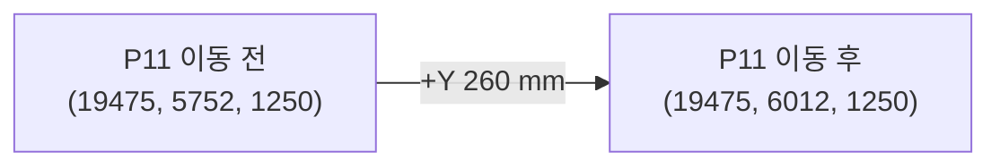

> P11은 런타임 옵션으로 바꾸지 않고 **Git 브랜치별 하드코딩 좌표**를 사용합니다.

---

# 4. 위치추정 원리

## 단일 마커

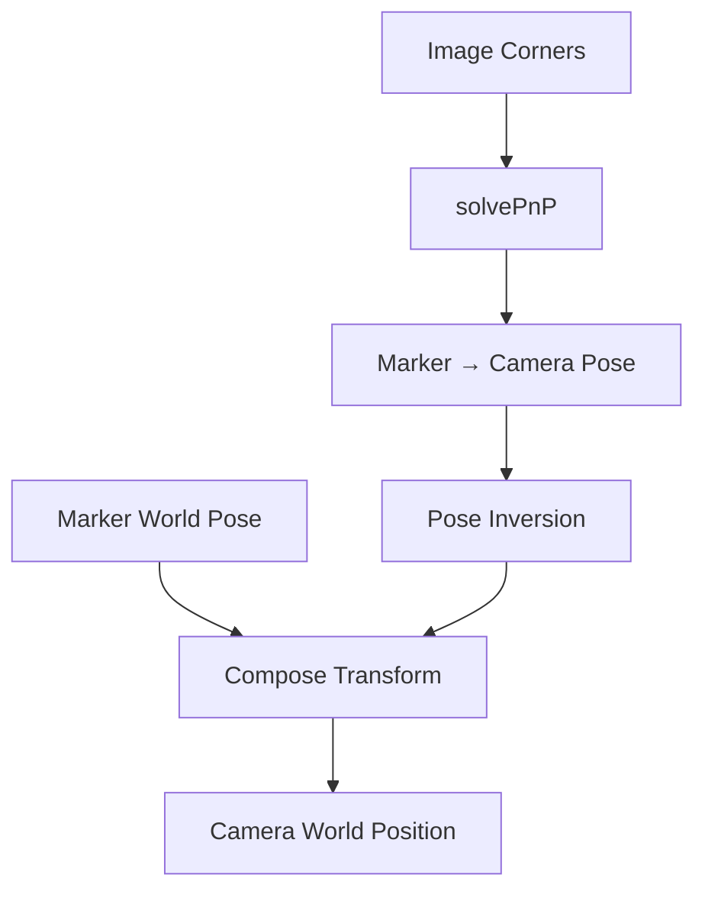

마커 코너는 정사각형 PnP 규칙을 사용합니다.

```text
TL = (-h, +h, 0)
TR = (+h, +h, 0)
BR = (+h, -h, 0)
BL = (-h, -h, 0)

h = marker_size / 2
```

## 다중 마커 융합

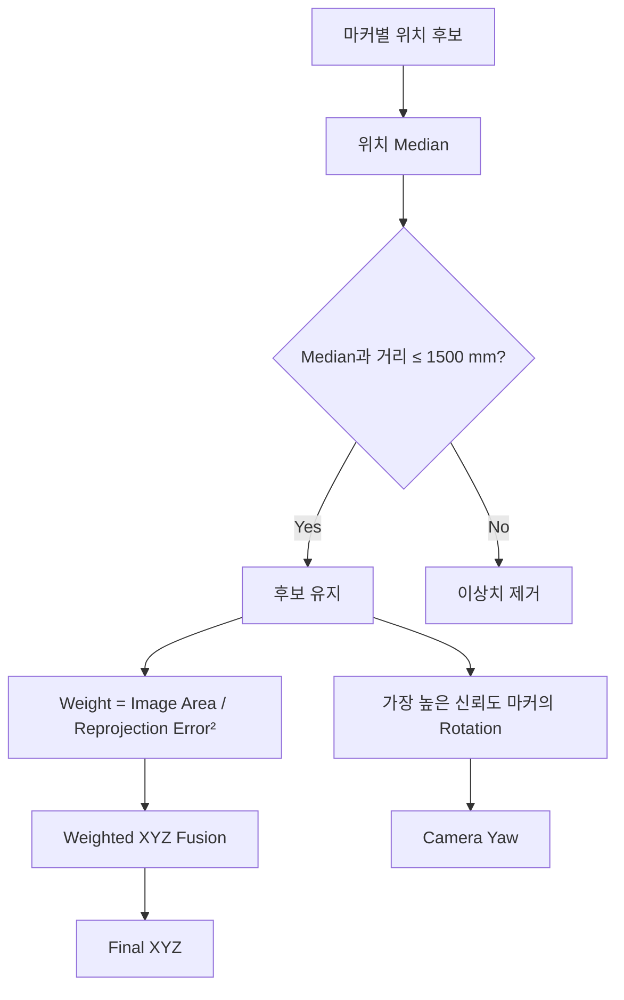

| 요소 | 영향 |
|---|---|
| 화면에서 크게 보이는 마커 | 가중치 증가 |
| 재투영 오차가 작은 마커 | 가중치 증가 |
| 작은/비스듬한/불안정 마커 | 가중치 감소 |
| 위치가 중앙값에서 크게 벗어남 | 후보 제거 |

---

# 5. 위치 안정화

실시간 위치가 한 프레임에서 갑자기 멀리 튀는 현상을 바로 반영하지 않습니다.

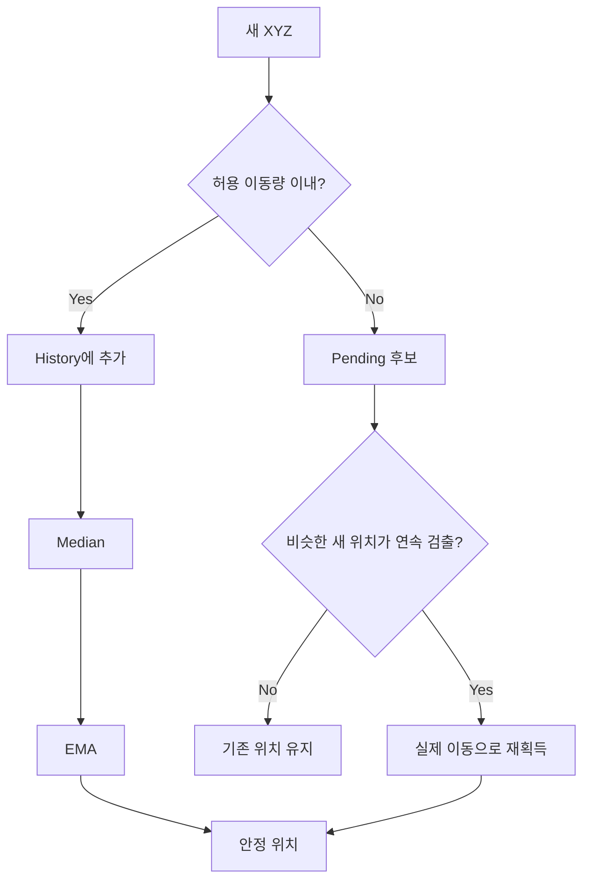

### 위치가 잠깐 사라진 경우

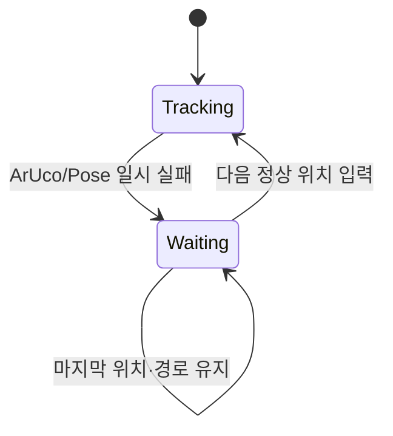

즉, 마커가 순간적으로 사라져도 미니맵과 네비게이션이 즉시 초기화되지 않습니다.

---

# 6. 네비게이션

## 이동 순서

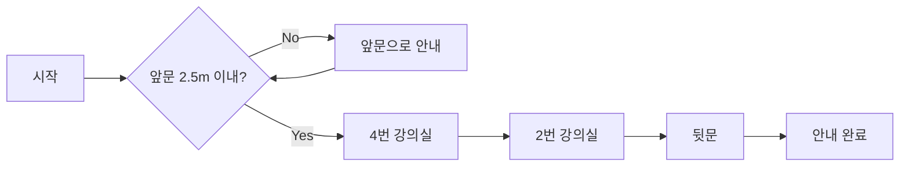

### 경유지 판정

| 지점 | 판정 | 반경 |
|---|---|---:|
| 앞문 | 출발 | 2500 mm |
| 4번 강의실 | 경유 | 2500 mm |
| 2번 강의실 | 경유 | 2500 mm |
| 뒷문 | 도착 | 2500 mm |

## 경로 중심선

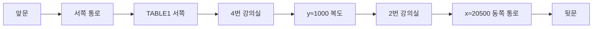

> 이 경로는 **등록된 지도 구조물을 기반으로 수동 정의한 waypoint 경로**입니다.  
> 영상 속 사람/의자/이동식 물체를 자동 회피하는 시스템은 아닙니다.

---

# 7. 시선 기준 방향 UI

웹캠 중앙을 가리는 AR 도로는 사용하지 않습니다.

현재 UI는:

```text
현재 카메라 시선
vs
가야 할 경로 방향
```

의 각도 차이를 보여줍니다.

| 표시 | 의미 |
|---|---|
| 가운데 흰 선 | 지금 카메라가 보고 있는 정면 |
| 노란 삼각형 | 가야 할 방향 |
| 초록 점 | 실제 좌표 변화로 계산한 이동 방향 |
| 직선 화살표 | 시선 기준 목표 방향 |

### 안내 문구 예

| 상황 | 화면 문구 |
|---|---|
| 거의 정면 | `직진하세요.` |
| 왼쪽 35° | `왼쪽으로 35° 가세요.` |
| 오른쪽 60° | `오른쪽으로 60° 가세요.` |
| 왼쪽 뒤 165° | `왼쪽으로 165° 가세요.` |

> `회전하세요`, `U턴하세요` 같은 표현 대신 **실제로 어느 방향으로 가야 하는지**를 표시합니다.

---

# 8. 네비게이션 상태

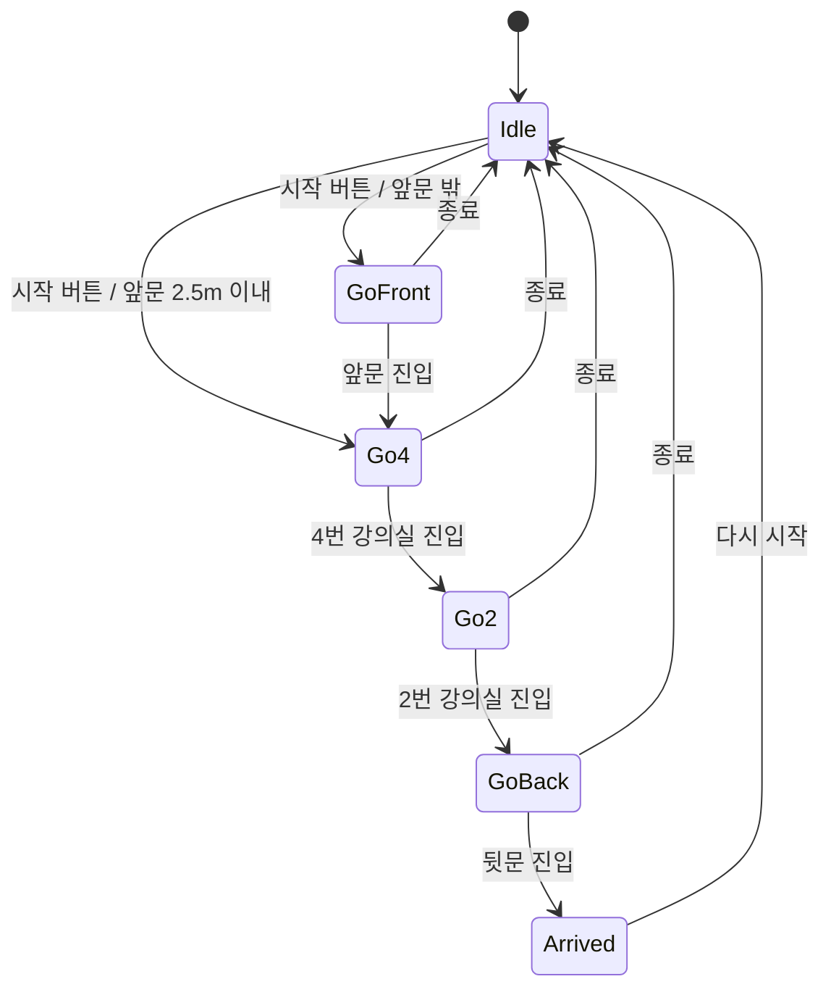

이벤트 메시지는 약 **2초간 크게 표시**됩니다.

| 이벤트 | 메시지 예 |
|---|---|
| 시작 | `네비게이션 시작 / 앞문 출발` |
| 앞문 복귀 | `앞문 도착 / 네비게이션 출발` |
| 4번 | `4번 강의실 경유` |
| 2번 | `2번 강의실 경유` |
| 뒷문 | `뒷문 도착 / 안내 완료` |
| 종료 | `네비게이션 종료` |

---

# 9. 경로 진행 표시

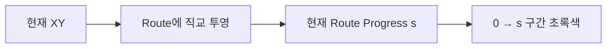

진행률은 최고값을 누적 저장하지 않습니다.

따라서 사용자가 뒤로 돌아가면:

```text
현재 투영 위치도 뒤로 이동
→ 지나온 길의 초록색 구간도 다시 줄어듦
```

---

# 10. 안전 경고

| 항목 | 기본값 | 동작 |
|---|---:|---|
| 구조물/벽 접근 | 650 mm | 너무 가까우면 경고 |
| 계획 경로 이탈 | 1500 mm | 경로 선으로 복귀 안내 |
| 다중 마커 위치 이상치 | 1500 mm | Fusion 후보에서 제외 |
| 경유/도착 | 2500 mm | 해당 공간 도달로 판정 |

> 문 개구부는 벽에서 제외합니다.

---

# 11. 카메라 캘리브레이션

기본 체스보드:

| 항목 | 값 |
|---|---:|
| 내부 코너 | 9 × 6 |
| 정사각형 | 25 mm |
| 기본 해상도 | 1280 × 720 |
| 권장 샘플 | 15 ~ 30장 |

실행:

```powershell
python calibrate_webcam.py --camera 1
```

조작:

| 키 | 기능 |
|---|---|
| `SPACE` | 샘플 추가 |
| `C` | 캘리브레이션 계산/저장 |
| `Q` | 종료 |

생성 파일:

```text
camera_calibration.npz
```

> 같은 카메라와 같은 해상도에서 사용하는 것이 중요합니다.

---

# 12. 라이브 위치추정

```powershell
python webcam_localizer.py --camera 1
```

화면 축소:

```powershell
python webcam_localizer.py --camera 1 --preview-width 720 --map-preview-width 650
```

근사 카메라 모델:

```powershell
python webcam_localizer.py --camera 1 --force-approx --hfov 60
```

---

# 13. 실시간 네비게이션

```powershell
python navigation_live.py --camera 1
```

### 조작

| 키/버튼 | 기능 |
|---|---|
| `네비게이션 시작 / 다시 시작` | 경로 안내 시작 |
| `네비게이션 종료` | 안내만 중단 |
| `N` | 시작/재시작 |
| `X` | 네비게이션 종료 |
| `S` | 현재 카메라 화면 저장 |
| `Q / ESC` | 프로그램 종료 |

### Navigation Control 성능 표시

| 항목 | 의미 |
|---|---|
| `Frame` | 현재 처리 프레임 번호 |
| `화면 FPS` | 메인 루프 기준 화면 갱신 속도 |
| `처리 ms` | 카메라 입력 → 위치추정 → 네비게이션 → 지도 생성 시간 |
| `처리 FPS` | 처리시간을 FPS로 환산한 값 |

---

# 14. 녹화 영상

기본:

```powershell
python video_localizer.py test.mp4 --preview
```

촬영 장비를 모르는 경우:

```powershell
python video_localizer.py test.mp4 --no-calibration --preview
```

## Preview mode

| 모드 | 특징 | 용도 |
|---|---|---|
| `all` | 모든 프레임 분석 | 정량 비교 |
| `all --preview-fast` | 대기 없이 전 프레임 분석 | 빠른 처리 |
| `realtime` | 실제 재생시간 우선, 필요 시 source frame skip | 시연/흐름 확인 |

예:

```powershell
python video_localizer.py test.mp4 --no-calibration --preview --preview-mode all
```

---

# 15. 영상 결과 비교

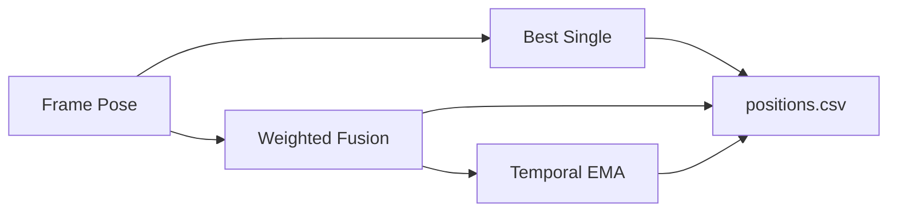

| 방식 | 설명 |
|---|---|
| Best Single | 신뢰도 가장 높은 단일 마커 |
| Weighted Fusion | 여러 마커 이상치 제거 후 가중 평균 |
| Temporal EMA | Fusion 결과 시간축 평활화 |

Ground Truth가 있으면:

```powershell
python compare_localization_results.py test_results\positions.csv --ground-truth gt.csv
```

평가 예:

```text
MAE 3D
RMSE 3D
Median 3D Error
P95 3D Error
MAE XY
RMSE XY
```

---

# 16. 단일 이미지 / 이미지 일괄 판정

## 단일 이미지

```powershell
python image_localizer.py test.jpg --no-calibration --preview
```

생성:

```text
annotated.png
map.png
result.json
```

## 여러 이미지

```powershell
python batch_image_localizer.py "C:\이미지폴더" --no-calibration
```

결과:

```text
image_results/
├─ 0001_name/
│  ├─ annotated.png
│  ├─ map.png
│  └─ result.json
├─ ...
├─ batch_summary.csv
├─ batch_summary.json
├─ batch_summary.html
└─ failed_images.txt
```

브라우저:

```powershell
start .\image_results\batch_summary.html
```

> HTML만 따로 보내면 이미지 상대경로가 깨질 수 있으므로 `image_results` 폴더 전체를 ZIP으로 전달합니다.

---

# 17. 파일 구조

```text
machine-vision1/
├─ aruco_world_map.py
├─ camera_calibration.py
├─ calibrate_webcam.py
├─ check_marker_database.py
├─ coordinate_system.py
├─ pose_localizer.py
├─ live_map_view.py
├─ webcam_localizer.py
├─ navigation_engine.py
├─ navigation_live.py
├─ video_localizer.py
├─ image_localizer.py
├─ batch_image_localizer.py
├─ compare_localization_results.py
├─ requirements_navigation.txt
├─ docs/
│  ├─ navigation_v7_ui_overview.png
│  └─ navigation_v7_straight_arrow_preview.png
└─ README.md
```

## 파일 역할

| 파일 | 역할 |
|---|---|
| `aruco_world_map.py` | 마커 ID/크기/XYZ/FACE/TOP |
| `camera_calibration.py` | 카메라 파라미터 로딩 + HFOV 근사 |
| `calibrate_webcam.py` | 체스보드 캘리브레이션 |
| `coordinate_system.py` | 문/랜드마크 좌표와 거리 |
| `pose_localizer.py` | PnP, 좌표변환, 다중 마커 융합 |
| `live_map_view.py` | XY 미니맵 |
| `webcam_localizer.py` | 실시간 위치추정 |
| `navigation_engine.py` | 경로/상태/안정화/UI |
| `navigation_live.py` | 라이브 네비게이션 실행 |
| `video_localizer.py` | 동영상 분석 |
| `image_localizer.py` | 단일 이미지 판정 |
| `batch_image_localizer.py` | 이미지 폴더 일괄 판정 |
| `compare_localization_results.py` | 결과 비교/오차 평가 |

---

# 18. 대표 이슈와 해결

| 문제 | 원인 | 현재 대응 |
|---|---|---|
| 실측/CAD 누적오차 | 3m 줄자, 상대 측정 | mm 좌표 통일 + 현장 재검증 |
| 마커 방향 해석 오류 | 설치 문자열 해석 혼동 | `FACE/TOP` 직접 정의 |
| ID/크기/위치 불일치 | 현장 정보 변경 | Marker DB 중앙관리 |
| P10 Pose 불안정 | 마커가 평평하지 않음 | 재부착 권장 + reprojection 신뢰도 반영 |
| P11 가림 | 장애물 Occlusion | `+Y 260mm` 이동 브랜치 |
| 먼/작은 마커 미검출 | 픽셀 부족 | 크기/거리/각도/조명 점검 |
| 다른 카메라 영상 | Calibration 불일치 | `--no-calibration --hfov` |
| 순간 좌표 튐 | PnP/검출 노이즈 | Jump gate + Median + EMA |
| 마커 순간 미검출 | 가림/각도 | 마지막 정상 상태 유지 |
| 작은 노트북 화면 | 2창/3창 정보 충돌 | 카메라/맵/컨트롤 분리 |

---

# 19. 제한사항

| 제한 | 의미 |
|---|---|
| 마커 의존 | 등록 ArUco가 보이지 않으면 새 절대 위치 갱신 불가 |
| 실측 오차 | 지도 좌표 오차가 위치 결과에 직접 반영 |
| 광학 중심 | 사용자 몸 중심이 아니라 카메라 위치 |
| 2.5m 판정 | 실제 방 경계가 아니라 중심점 XY 거리 |
| 정적 장애물 | 등록한 벽/구조물만 거리 경고 |
| 동적 장애물 | 사람/의자 실시간 회피 없음 |
| 뒷문 | 현재 기존 쪽문 좌표 사용 |
| HFOV 근사 | 직접 Calibration보다 절대 위치 정확도가 낮음 |

---

# 20. 프로젝트 성격

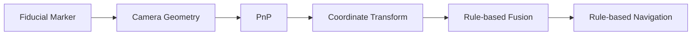

### 사용하는 것

```text
OpenCV
ArUco Fiducial Marker
Camera Calibration
solvePnP
Rigid Coordinate Transform
Weighted Fusion
Rule-based Navigation
```

### 사용하지 않는 것

```text
Deep Learning
Machine Learning
Neural Network
Model Training
```

---

<details>
<summary><strong>동영상 결과 파일 / CSV 컬럼 자세히 보기</strong></summary>

### 기본 결과

```text
test_results/
├─ annotated.mp4
├─ positions.csv
├─ summary.json
└─ snapshots/
```

주요 `positions.csv` 컬럼:

```text
frame
time_sec
detected_ids
registered_ids
used_ids
rejected_ids

best_single_x_mm
best_single_y_mm
best_single_z_mm

fused_x_mm
fused_y_mm
fused_z_mm

ema_x_mm
ema_y_mm
ema_z_mm

yaw_deg
spread_mm
nearest_landmark
nearest_landmark_distance_mm
```

</details>

<details>
<summary><strong>현장 테스트 체크리스트</strong></summary>

- [ ] 사용 웹캠과 Calibration 파일이 일치하는가
- [ ] 실행 해상도가 Calibration 해상도와 같은가
- [ ] ArUco 출력 실제 크기가 `size_mm`와 일치하는가
- [ ] 마커가 평평하게 부착되어 있는가
- [ ] FACE / TOP 설치방향이 DB와 일치하는가
- [ ] P11 브랜치 좌표가 현장 상태와 일치하는가
- [ ] 앞문/4번/2번/뒷문 2.5m 판정을 현장에서 확인했는가
- [ ] 650mm 벽 경고가 실제 통로 폭에 적절한가
- [ ] 카메라 창 방향 지시가 실제 시선 기준과 일치하는가
- [ ] 위치가 잠깐 끊겨도 UI가 유지되는가

</details>

---

## 한 줄 설명

> **ArUco 마커와 PnP 기반의 비학습식 실내 위치추정 시스템에, 실측 좌표 기반의 규칙식 실내 네비게이션을 결합한 프로젝트입니다.**
