# ArUco Indoor Localizer

<<<<<<< HEAD
<details open>
<summary><strong>📌 요약 보기</strong></summary>

<br>

ArUco 마커와 OpenCV `solvePnP`를 이용하여 실내에서 **카메라의 위치 `(x, y, z)`와 방향을 추정하는 비학습식 실내 위치추정 시스템**입니다.

딥러닝, 머신러닝, 신경망 학습 모델을 사용하지 않고 **ArUco Fiducial Marker + 카메라 기하학 + PnP**를 이용합니다.

## 핵심 기능

- 실시간 웹캠 ArUco 검출
- 마커별 카메라 월드 좌표 계산
- 다중 마커 이상치 제거
- 신뢰도 기반 가중 평균
- 카메라 방향(Yaw) 계산
- 실시간 XY 미니맵
- 문/랜드마크 주변 위치 판정
- 체스보드 기반 카메라 캘리브레이션
- 캘리브레이션이 없는 영상의 HFOV 근사 모드
- 녹화 동영상 위치 판정
- `Best Single / Weighted Fusion / Temporal EMA` 비교
- 결과 영상 / CSV / JSON 저장
- Ground Truth 기반 MAE / RMSE / P95 비교

## 가장 빠른 실행

### 실시간 위치추정
=======

<details open>
<summary><strong>📌 요약 보기</strong></summary>

<br>

ArUco 마커와 OpenCV `solvePnP`를 이용해 **실내에서 카메라의 위치 `(x, y, z)`와 방향을 추정하는 비학습식 위치추정 시스템**입니다.

### 핵심 기능

- 실시간 웹캠 ArUco 검출
- 마커별 카메라 위치 계산
- 다중 마커 이상치 제거 + 가중 평균
- 카메라 Yaw 계산
- 실시간 XY 미니맵
- 문/랜드마크 주변 판정
- 체스보드 카메라 캘리브레이션
- 캘리브레이션이 없는 영상의 HFOV 근사 모드
- 녹화 동영상 분석
- `Best Single / Weighted Fusion / Temporal EMA` 비교
- CSV / JSON / 결과 영상 저장
- Ground Truth 기반 MAE / RMSE / P95 평가

### 가장 빠른 실행

**실시간 위치추정**
>>>>>>> 0e4e52d (Update map, front door, landmark distance and Z display)

```powershell
python webcam_localizer.py --camera 1
```

<<<<<<< HEAD
### 카메라 번호 확인
=======
**카메라 목록 확인**
>>>>>>> 0e4e52d (Update map, front door, landmark distance and Z display)

```powershell
python webcam_localizer.py --list-cameras
```

<<<<<<< HEAD
### 카메라 캘리브레이션
=======
**카메라 캘리브레이션**
>>>>>>> 0e4e52d (Update map, front door, landmark distance and Z display)

```powershell
python calibrate_webcam.py --camera 1
```

<<<<<<< HEAD
### 테스트 영상 분석
=======
**녹화 영상 분석**
>>>>>>> 0e4e52d (Update map, front door, landmark distance and Z display)

```powershell
python video_localizer.py test.mp4 --preview
```

<<<<<<< HEAD
### 촬영 장비를 알 수 없는 영상
=======
**촬영 장비를 알 수 없는 영상**
>>>>>>> 0e4e52d (Update map, front door, landmark distance and Z display)

```powershell
python video_localizer.py test.mp4 --no-calibration --preview
```

<<<<<<< HEAD
### 결과 비교
=======
**결과 비교**
>>>>>>> 0e4e52d (Update map, front door, landmark distance and Z display)

```powershell
python compare_localization_results.py test_results\positions.csv
```

<<<<<<< HEAD
## 전체 처리 흐름
=======
### 전체 처리 흐름
>>>>>>> 0e4e52d (Update map, front door, landmark distance and Z display)

```mermaid
flowchart LR
    A[Camera / Video] --> B[ArUco Detection]
    B --> C[Marker ID Lookup]
    C --> D[solvePnP]
    D --> E[World Coordinate Transform]
<<<<<<< HEAD
    E --> F[Per-Marker Camera Pose]
    F --> G[Outlier Rejection]
    G --> H[Weighted Fusion]
    H --> I[Final XYZ Position]
    H --> J[Camera Yaw]
    I --> K[Live XY Map]
    J --> K
    I --> L[Landmark Distance Check]
    L --> M[주변 위치 판정]
```

## 사용 기술

```text
ArUco Fiducial Marker
+
OpenCV
+
Camera Calibration
+
solvePnP
+
Coordinate Transform
+
Multi-Marker Weighted Fusion
```

학습 과정은 사용하지 않습니다.

```text
Deep Learning X
Machine Learning X
Neural Network X
Model Training X
```

> 설치 방법, 좌표계, 가중 평균, 동영상 테스트, 평가 방법 및 프로젝트 구조는 아래의 **자세히 보기**에서 확인할 수 있습니다.

</details>

---
=======
    E --> F[Per-Marker Pose]
    F --> G[Outlier Rejection]
    G --> H[Weighted Fusion]
    H --> I[Final XYZ + Yaw]
    I --> J[Live Map / Landmark Decision]
```

### 사용 기술

```text
ArUco Fiducial Marker
+ OpenCV
+ Camera Calibration
+ solvePnP
+ Coordinate Transform
+ Weighted Multi-Marker Fusion
```

사용하지 않는 기술:

```text
Deep Learning
Machine Learning
Neural Network
Model Training
```

> 더 자세한 설치 방법, 좌표계, 가중 평균 방식, 동영상 테스트, Ground Truth 평가, 파일 구조와 제한사항은 아래 **자세히 보기**를 펼쳐 확인할 수 있습니다.

</details>


>>>>>>> 0e4e52d (Update map, front door, landmark distance and Z display)

<details>
<summary><strong>📖 자세히 보기</strong></summary>

<br>

<<<<<<< HEAD
# 1. 프로젝트 목적

실내 공간에 설치된 ArUco 마커를 카메라로 인식하고, 각 마커의 실제 월드 좌표와 방향 정보를 이용하여 **현재 카메라의 실내 위치를 추정**합니다.

카메라가 여러 마커를 동시에 인식한 경우 단순 평균이 아니라 각 마커의 신뢰도를 계산하여 위치를 융합합니다.

---

# 2. 시스템 구조

```mermaid
flowchart TD
    CAM[Camera / Video]
    DETECT[ArUco Detection]
    DB[Marker Database]
    PNP[solvePnP]
    TRANSFORM[World Coordinate Transform]
    POSE[Camera Pose]
    FILTER[Outlier Rejection]
    FUSION[Weighted Fusion]
    MAP[Live XY Map]
    LANDMARK[Landmark Decision]

    CAM --> DETECT
    DETECT --> DB
    DB --> PNP
    PNP --> TRANSFORM
    TRANSFORM --> POSE
    POSE --> FILTER
    FILTER --> FUSION
    FUSION --> MAP
    FUSION --> LANDMARK
=======
ArUco 마커와 PnP 기반으로 실내에서 카메라의 위치를 추정하는 **비학습식 실내 위치추정 시스템**입니다.

딥러닝, 머신러닝, 신경망 모델을 사용하지 않으며, OpenCV의 ArUco 검출과 카메라 기하학을 이용합니다.

주요 기능은 다음과 같습니다.

- 실시간 웹캠 기반 ArUco 검출
- 마커별 카메라 월드 좌표 계산
- 여러 마커 검출 시 이상치 제거 + 가중 평균
- 카메라 방향(Yaw) 계산
- 실시간 XY 미니맵 표시
- 문/랜드마크 주변 판정
- 체스보드 기반 카메라 캘리브레이션
- 캘리브레이션이 없는 카메라의 HFOV 근사 모드
- 녹화 동영상 기반 위치 판정
- 단일 마커 / 다중 마커 융합 / 시간축 EMA 결과 비교
- 결과 영상, CSV, JSON 저장
- Ground Truth 기반 MAE / RMSE / P95 비교

---

## 1. 시스템 개요

```mermaid
flowchart LR
    A[Camera / Video] --> B[ArUco Detection]
    B --> C[Marker ID Lookup]
    C --> D[solvePnP]
    D --> E[Marker Coordinate to World Coordinate]
    E --> F[Camera Position per Marker]

    F --> G[Outlier Rejection]
    G --> H[Weighted Fusion]
    H --> I[Final XYZ Position]

    H --> J[Best Rotation Selection]
    J --> K[Camera Yaw]

    I --> L[Live XY Map]
    K --> L

    I --> M[Landmark Distance Check]
    M --> N[주변 위치 판정]
>>>>>>> 0e4e52d (Update map, front door, landmark distance and Z display)
```

---

<<<<<<< HEAD
# 3. 월드 좌표계

본 프로젝트의 좌표 단위는 **mm**입니다.
=======
## 2. 위치 추정 방식

각 ArUco 마커는 다음 정보를 가집니다.

- Marker ID
- 실제 마커 크기(mm)
- 월드 좌표 `(x, y, z)`
- 마커 정면 방향 `FACE`
- 마커 이미지의 위쪽 방향 `TOP`

마커 로컬 좌표계는 다음과 같습니다.

```text
local +X = RIGHT
local +Y = TOP
local +Z = FACE
```

`RIGHT` 방향은 다음 식으로 계산합니다.

```text
RIGHT = TOP × FACE
```

카메라 위치 계산은 각 마커에 대해 `solvePnP()`를 수행한 뒤 월드 좌표계로 변환합니다.

---

## 3. 여러 마커가 동시에 보일 때

여러 마커에서 계산된 위치를 단순 평균하지 않습니다.

먼저 위치가 크게 벗어난 결과를 제거하고, 남은 마커에 대해 신뢰도 기반 가중 평균을 수행합니다.

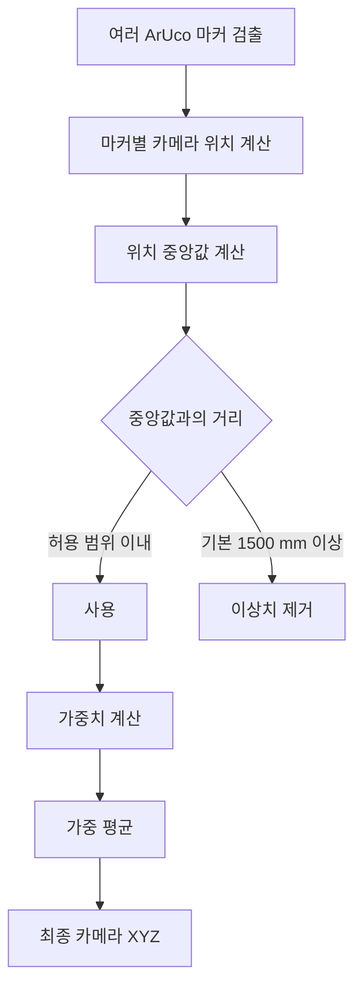

가중치는 기본적으로 다음 요소를 반영합니다.

```text
가중치 ∝ 마커가 화면에서 차지하는 면적 / 재투영 오차²
```

따라서:

- 화면에서 크게 보이는 마커 → 높은 가중치
- 재투영 오차가 작은 마커 → 높은 가중치
- 작게 보이거나 자세 추정이 불안정한 마커 → 낮은 가중치

위치는 여러 마커를 융합하지만, 회전행렬은 단순 평균하지 않고 신뢰도가 높은 마커의 회전을 사용합니다.

---

## 4. 월드 좌표계

본 프로젝트는 **mm 단위**를 사용합니다.
>>>>>>> 0e4e52d (Update map, front door, landmark distance and Z display)

```text
+X : 평면도 기준 오른쪽
-X : 평면도 기준 왼쪽

+Y : 평면도 기준 위쪽
-Y : 평면도 기준 아래쪽

+Z : 바닥 → 천장
-Z : 천장 → 바닥
```

<<<<<<< HEAD
마커 좌표계:

```text
local +X = RIGHT
local +Y = TOP
local +Z = FACE
```

마커의 오른쪽 방향은 다음과 같이 계산합니다.

```text
RIGHT = TOP × FACE
=======
```mermaid
flowchart TB
    Z["+Z : Ceiling"]
    O["Origin / XY Plane"]
    NZ["-Z"]
    X["+X : Right"]
    NX["-X : Left"]
    Y["+Y : Up on Map"]
    NY["-Y : Down on Map"]

    Z --- O
    O --- NZ
    NX --- O --- X
    Y --- O --- NY
>>>>>>> 0e4e52d (Update map, front door, landmark distance and Z display)
```

---

<<<<<<< HEAD
# 4. ArUco Marker Database

각 ArUco 마커에는 다음 정보가 저장됩니다.

```text
point_name
name
description
marker_id
size_mm
x
y
z
face_world
top_world
```

예를 들어 마커의 월드 위치가 다음과 같다면:

```text
x = 19475 mm
y = 6012 mm
z = 1250 mm
```

이는 마커 중심이 해당 월드 좌표에 있다고 가정합니다.

마커 데이터는 다음 파일에서 관리합니다.

```text
aruco_world_map.py
```

데이터 검증:

```powershell
python check_marker_database.py
=======
# 설치

## 5. 요구 환경

권장 환경:

```text
Python 3.10+
Windows
OpenCV Contrib
NumPy
```

필수 패키지:

```powershell
python -m pip install numpy opencv-contrib-python
```

또는:

```powershell
python -m pip install -r requirements.txt
```

설치 확인:

```powershell
python -c "import cv2, numpy; print(cv2.__version__); print(hasattr(cv2, 'aruco'))"
```

마지막 값이 `True`여야 합니다.

---

## 6. 가상환경 사용

Windows PowerShell 기준:

```powershell
python -m venv .venv
```

활성화:

```powershell
.\.venv\Scripts\Activate.ps1
```

패키지 설치:

```powershell
python -m pip install -r requirements.txt
```

현재 사용 중인 Python 확인:

```powershell
python -c "import sys; print(sys.executable)"
>>>>>>> 0e4e52d (Update map, front door, landmark distance and Z display)
```

---

<<<<<<< HEAD
# 5. 카메라 위치 추정

카메라가 ArUco 마커를 검출하면 OpenCV의 `solvePnP()`를 사용하여 마커와 카메라 사이의 자세를 계산합니다.

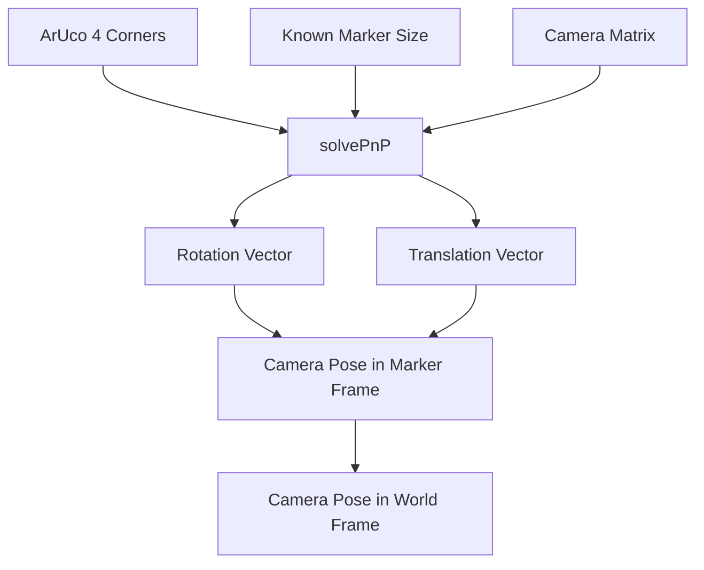

`solvePnP()`의 결과를 역변환한 뒤 마커의 월드 좌표계와 결합하여 최종 카메라 위치를 계산합니다.

---

# 6. 다중 마커 가중 평균

여러 마커가 동시에 보이는 경우 각 마커에서 개별적으로 카메라 위치를 계산합니다.

예:

```text
P03 → Camera Position A
P05 → Camera Position B
P07 → Camera Position C
```

그 다음 이상치를 제거합니다.

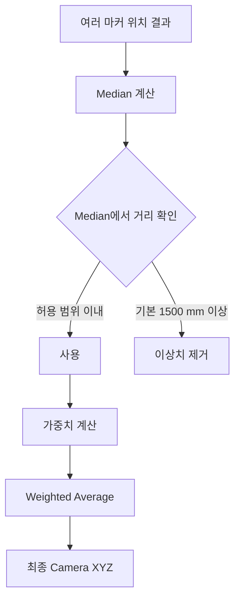

기본 가중치는 다음 요소를 사용합니다.

```text
weight ∝ marker_area_px² / reprojection_error_px²
```

즉,

```text
마커가 화면에서 크게 보임
→ 신뢰도 증가

재투영 오차가 작음
→ 신뢰도 증가
```

최종 위치:

```text
Pfinal = Σ(wi × Pi) / Σwi
```

회전행렬은 단순 평균하지 않고 **가중치가 가장 높은 마커의 방향을 대표 방향으로 사용**합니다.

---

# 7. 카메라 캘리브레이션

카메라의 정확한 내부 파라미터를 구하기 위해 체스보드 기반 캘리브레이션을 지원합니다.

=======
# 카메라 캘리브레이션

## 7. 캘리브레이션 실행

카메라 고유의 초점거리와 렌즈 왜곡을 얻기 위해 체스보드 캘리브레이션을 지원합니다.

기본 설정:

```text
내부 코너 : 9 × 6
정사각형 크기 : 25 mm
해상도 : 1280 × 720
```

>>>>>>> 0e4e52d (Update map, front door, landmark distance and Z display)
실행:

```powershell
python calibrate_webcam.py --camera 1
```

<<<<<<< HEAD
기본 설정:

```text
체스보드 내부 코너 : 9 × 6
정사각형 크기      : 25 mm
권장 해상도        : 1280 × 720
```

조작키:

```text
SPACE : 현재 프레임을 캘리브레이션 샘플로 추가
=======
카메라 번호를 모를 경우:

```powershell
python calibrate_webcam.py
```

### 조작키

```text
SPACE : 현재 체스보드 프레임을 샘플로 추가
>>>>>>> 0e4e52d (Update map, front door, landmark distance and Z display)
C     : 캘리브레이션 계산 및 저장
Q     : 종료
```

<<<<<<< HEAD
권장 샘플:
=======
권장 샘플 수:
>>>>>>> 0e4e52d (Update map, front door, landmark distance and Z display)

```text
15 ~ 30장
```

<<<<<<< HEAD
결과:
=======
샘플은 화면 중앙만 찍지 말고 다음과 같이 다양하게 확보하는 것이 좋습니다.

- 좌측 / 우측
- 상단 / 하단
- 가까운 거리 / 먼 거리
- 기울어진 각도

결과 파일:
>>>>>>> 0e4e52d (Update map, front door, landmark distance and Z display)

```text
camera_calibration.npz
```

<<<<<<< HEAD
캘리브레이션 샘플:
=======
채택된 체스보드 이미지는 기본적으로:
>>>>>>> 0e4e52d (Update map, front door, landmark distance and Z display)

```text
calibration_samples/
```

<<<<<<< HEAD
캘리브레이션은 다음 요소를 계산합니다.

```text
Camera Matrix
Distortion Coefficients
Image Width
Image Height
RMS Error
```

> 카메라가 변경되거나 렌즈/해상도가 변경되면 다시 캘리브레이션하는 것이 좋습니다.

---

# 8. 실시간 웹캠 실행

카메라 목록 확인:
=======
에 저장됩니다.

> 캘리브레이션 파일은 **촬영한 카메라와 해상도에 종속적**입니다. 다른 장비로 촬영한 영상에 기존 캘리브레이션 값을 그대로 적용하면 위치 오차가 증가할 수 있습니다.

---

# 실시간 위치 추정

## 8. 연결된 카메라 확인
>>>>>>> 0e4e52d (Update map, front door, landmark distance and Z display)

```powershell
python webcam_localizer.py --list-cameras
```

<<<<<<< HEAD
실행:
=======
예:

```text
[FOUND] camera 0 ...
[FOUND] camera 1 ...
```

---

## 9. 라이브 실행

예를 들어 외장 웹캠이 `camera 1`이라면:
>>>>>>> 0e4e52d (Update map, front door, landmark distance and Z display)

```powershell
python webcam_localizer.py --camera 1
```

<<<<<<< HEAD
실시간으로 다음 정보를 표시합니다.

```text
ArUco ID
Marker Name
Camera XYZ
Camera Yaw
사용된 Marker
Position Spread
현재 위치 주변 Landmark
```

---

# 9. 라이브 화면

라이브 실행 시 다음 두 화면을 별도로 표시합니다.

```text
ArUco Indoor Localizer V2
→ 카메라 영상 및 위치 정보

Indoor XY Map
→ 현재 위치 및 실내 미니맵
```

노트북 화면에 맞게 축소:
=======
기본 동작:

- 카메라 화면 표시
- ArUco ID 표시
- 마커별 위치 계산
- 다중 마커 위치 융합
- 현재 XYZ 표시
- 현재 방향 표시
- 실시간 XY 미니맵 표시
- 가까운 문/랜드마크 판정

카메라 창과 미니맵은 **서로 독립된 창**으로 표시됩니다.

### 노트북 화면에 맞게 축소
>>>>>>> 0e4e52d (Update map, front door, landmark distance and Z display)

```powershell
python webcam_localizer.py --camera 1 --preview-width 720 --map-preview-width 650
```

<<<<<<< HEAD
화면 축소는 **표시용 영상에만 적용**됩니다.

ArUco 검출 및 PnP 계산은 원본 프레임을 그대로 사용합니다.

---

# 10. 위치 주변 판정

현재 카메라의 XY 좌표와 등록된 문/랜드마크의 거리를 계산합니다.

기본 기준:

```text
3 m = 3000 mm
```

예:

```text
2번강의실 주변입니다.
```

이 판정은 현재 **XY 평면상의 직선거리**를 기준으로 합니다.

장애물, 실제 이동 경로, Z 높이는 고려하지 않습니다.

---

# 11. 실시간 미니맵

미니맵에는 다음 정보가 표시됩니다.

```text
벽
문
구조물
ArUco 마커 위치
현재 카메라 위치
카메라 방향
사용된 Marker
Position Spread
```

처리 과정:

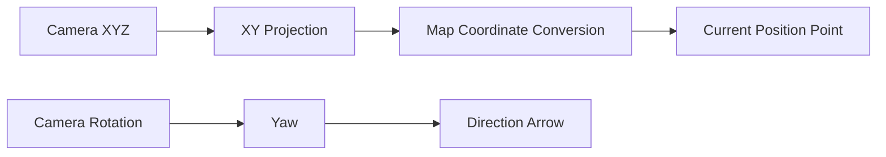

미니맵 비활성화:
=======
이 옵션은 **표시 화면만 축소**합니다.

ArUco 검출 및 PnP 계산은 원본 카메라 프레임 해상도로 계속 수행됩니다.

---

## 10. 라이브 조작키

```text
S     : 현재 카메라 프레임 저장
I     : 현재 검출된 마커별 위치 정보 콘솔 출력
Q     : 종료
ESC   : 종료
```

---

## 11. 캘리브레이션 없이 라이브 테스트

캘리브레이션 파일을 강제로 사용하지 않고 근사 카메라 모델로 실행:

```powershell
python webcam_localizer.py --camera 1 --force-approx
```

기본 수평 화각:

```text
HFOV = 60°
```

다른 값을 사용할 경우:

```powershell
python webcam_localizer.py --camera 1 --force-approx --hfov 70
```

이 방식은 현장 기능 테스트에는 사용할 수 있지만, 실제 mm 단위 절대 위치 정확도는 직접 캘리브레이션한 경우보다 낮을 수 있습니다.

---

# 실시간 미니맵

## 12. 미니맵 표시

`live_map_view.py`는 실측 및 CAD 기반 실내 구조를 XY 평면도로 표현합니다.

표시되는 정보:

```text
구조물 / 벽 / 문
등록된 ArUco 위치
현재 카메라 위치
카메라의 XY 진행 방향
사용된 마커
위치 산포(spread)
```

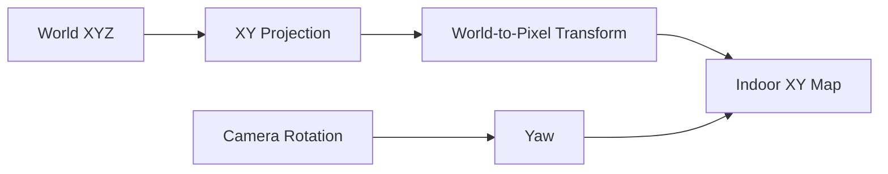

미니맵을 끄려면:
>>>>>>> 0e4e52d (Update map, front door, landmark distance and Z display)

```powershell
python webcam_localizer.py --camera 1 --no-map
```

---

<<<<<<< HEAD
# 12. 캘리브레이션 없는 근사 모드

카메라 캘리브레이션이 없는 경우 근사 카메라 모델을 사용할 수 있습니다.

라이브:

```powershell
python webcam_localizer.py --camera 1 --force-approx
```

기본:

```text
HFOV = 60°
```

직접 설정:

```powershell
python webcam_localizer.py --camera 1 --force-approx --hfov 70
```

이 경우:

```text
영상 크기 → 실제 영상에서 가져옴
HFOV → 사용자 지정 또는 기본 60°
Lens Distortion → 0으로 가정
```

> 근사 모드는 기능 확인에는 사용할 수 있지만 직접 캘리브레이션한 경우보다 절대 위치 정확도가 낮을 수 있습니다.

---

# 13. 테스트 동영상 분석

영상이 프로젝트 폴더에 있다면:
=======
# 녹화 동영상 테스트

## 13. 동영상 위치 판정

테스트 동영상이 프로젝트 폴더의 `test.mp4`라면:
>>>>>>> 0e4e52d (Update map, front door, landmark distance and Z display)

```powershell
python video_localizer.py test.mp4
```

<<<<<<< HEAD
실시간 확인:
=======
실시간으로 처리 과정을 확인하려면:
>>>>>>> 0e4e52d (Update map, front door, landmark distance and Z display)

```powershell
python video_localizer.py test.mp4 --preview
```

<<<<<<< HEAD
촬영 장비를 알 수 없는 영상:
=======
---

## 14. 촬영 장비를 알 수 없는 테스트 영상

촬영 카메라와 기존 `camera_calibration.npz`가 일치하지 않는 경우 기존 캘리브레이션을 사용하지 않는 것이 좋습니다.
>>>>>>> 0e4e52d (Update map, front door, landmark distance and Z display)

```powershell
python video_localizer.py test.mp4 --no-calibration --preview
```

<<<<<<< HEAD
HFOV 지정:
=======
이 경우:

- 영상 해상도는 실제 파일에서 읽음
- 수평 화각은 기본 `60°`로 가정
- 렌즈 왜곡은 0으로 가정
- 근사 카메라 행렬을 생성하여 사용

HFOV를 알고 있다면:
>>>>>>> 0e4e52d (Update map, front door, landmark distance and Z display)

```powershell
python video_localizer.py test.mp4 --no-calibration --hfov 70 --preview
```

<<<<<<< HEAD
---

# 14. 동영상 재생 조작
=======
> 촬영 장비와 카메라 내부 파라미터가 불명확한 영상은 절대 위치 정확도 평가보다 **동일 영상에 대한 알고리즘 비교**에 사용하는 것이 적절합니다.

---

## 15. 동영상 미리보기 조작
>>>>>>> 0e4e52d (Update map, front door, landmark distance and Z display)

```text
SPACE       : 일시정지 / 재생
N 또는 .    : 다음 프레임 1장
[ 또는 -    : 재생속도 감소
] 또는 +    : 재생속도 증가
<<<<<<< HEAD
R           : 1배속 복귀
=======
R           : 1.0배속
>>>>>>> 0e4e52d (Update map, front door, landmark distance and Z display)
S           : 현재 판정 화면 저장
Q / ESC     : 종료
```

지원 속도:

```text
0.125x
0.25x
0.5x
1.0x
1.5x
2.0x
4.0x
8.0x
```

<<<<<<< HEAD
미리보기 크기:
=======
미리보기 화면 크기 변경:
>>>>>>> 0e4e52d (Update map, front door, landmark distance and Z display)

```powershell
python video_localizer.py test.mp4 --no-calibration --preview --preview-width 800
```

---

<<<<<<< HEAD
# 15. 동영상 분석 결과

기본 결과:
=======
# 동영상 결과

## 16. 자동 생성 결과

기본적으로 다음 구조로 결과가 생성됩니다.
>>>>>>> 0e4e52d (Update map, front door, landmark distance and Z display)

```text
test_results/
├─ annotated.mp4
├─ positions.csv
├─ summary.json
└─ snapshots/
```

<<<<<<< HEAD
## annotated.mp4

영상에 다음 정보를 표시합니다.

```text
ArUco ID
Marker별 추정 위치
Best Single
Weighted Fusion
Temporal EMA
Mini Map
```

## positions.csv

프레임별 결과를 저장합니다.

=======
### `annotated.mp4`

다음 정보를 영상에 표시합니다.

- 검출된 ArUco ID
- 마커별 위치
- 최종 위치
- 융합 결과
- 시간축 보정 결과
- 미니맵

### `positions.csv`

프레임별 위치 추정 결과입니다.

주요 컬럼:

>>>>>>> 0e4e52d (Update map, front door, landmark distance and Z display)
```text
frame
time_sec

detected_ids
registered_ids
used_ids
rejected_ids

best_single_x_mm
best_single_y_mm
best_single_z_mm

fused_x_mm
fused_y_mm
fused_z_mm

ema_x_mm
ema_y_mm
ema_z_mm

yaw_deg
spread_mm
<<<<<<< HEAD
=======

>>>>>>> 0e4e52d (Update map, front door, landmark distance and Z display)
nearest_landmark
nearest_landmark_distance_mm
```

<<<<<<< HEAD
## summary.json

전체 테스트 결과를 요약합니다.

```text
Processed Frames
ArUco Detection Rate
Registered Marker Detection Rate
Pose Coverage
Mean Reprojection Error
Median Reprojection Error
Mean Spread
Median Spread
Marker Frequency
Camera Model Mode
Approximate HFOV
```

---

# 16. 위치 추정 방법 비교

동일한 영상에 대해 세 가지 결과를 동시에 계산합니다.

```mermaid
flowchart TD
    A[Video Frame]
    B[ArUco Pose Estimates]
    C[Best Single]
    D[Weighted Fusion]
    E[Temporal EMA]
    F[positions.csv]

    A --> B
    B --> C
    B --> D
    D --> E
    C --> F
=======
### `summary.json`

전체 영상에 대한 다음 정보를 저장합니다.

- 처리 프레임 수
- ArUco 검출률
- 등록 마커 검출률
- Pose 계산 성공률
- 평균 재투영 오차
- 중앙값 재투영 오차
- 위치 spread
- 사용된 마커 빈도
- 카메라 모델 방식
- HFOV 근사값

---

# 테스트 방법 비교

## 17. 세 가지 위치 결과

동영상 테스트에서는 동일 프레임에 대해 다음 세 결과를 저장합니다.

```mermaid
flowchart TD
    A[Frame] --> B[ArUco Pose Estimates]

    B --> C[Best Single]
    B --> D[Weighted Fusion]

    D --> E[Temporal EMA]

    C --> F[positions.csv]
>>>>>>> 0e4e52d (Update map, front door, landmark distance and Z display)
    D --> F
    E --> F
```

<<<<<<< HEAD
## Best Single

가장 신뢰도가 높은 단일 마커만 사용합니다.
=======
### Best Single

현재 프레임에서 신뢰도가 가장 높은 단일 마커의 위치만 사용합니다.
>>>>>>> 0e4e52d (Update map, front door, landmark distance and Z display)

```text
best_single_x_mm
best_single_y_mm
best_single_z_mm
```

<<<<<<< HEAD
## Weighted Fusion

여러 마커의 위치를 이상치 제거 후 가중 평균합니다.
=======
### Weighted Fusion

여러 마커의 이상치를 제거한 뒤 가중 평균한 결과입니다.
>>>>>>> 0e4e52d (Update map, front door, landmark distance and Z display)

```text
fused_x_mm
fused_y_mm
fused_z_mm
```

<<<<<<< HEAD
## Temporal EMA

Weighted Fusion 결과를 시간축으로 평활화합니다.
=======
### Temporal EMA

Weighted Fusion 결과에 시간축 EMA를 적용합니다.
>>>>>>> 0e4e52d (Update map, front door, landmark distance and Z display)

```text
ema_x_mm
ema_y_mm
ema_z_mm
```

<<<<<<< HEAD
기본:
=======
기본 EMA 계수:
>>>>>>> 0e4e52d (Update map, front door, landmark distance and Z display)

```text
alpha = 0.25
```

변경:

```powershell
python video_localizer.py test.mp4 --ema-alpha 0.4
```

---

<<<<<<< HEAD
# 17. Pose Frames

예:

```text
Pose frames : 127 (14.8%)
```

의 의미:

```text
전체 영상 프레임 중
유효한 카메라 위치/자세를 계산할 수 있었던 프레임 = 127

전체 프레임 대비 비율 = 14.8%
```

처리 흐름:

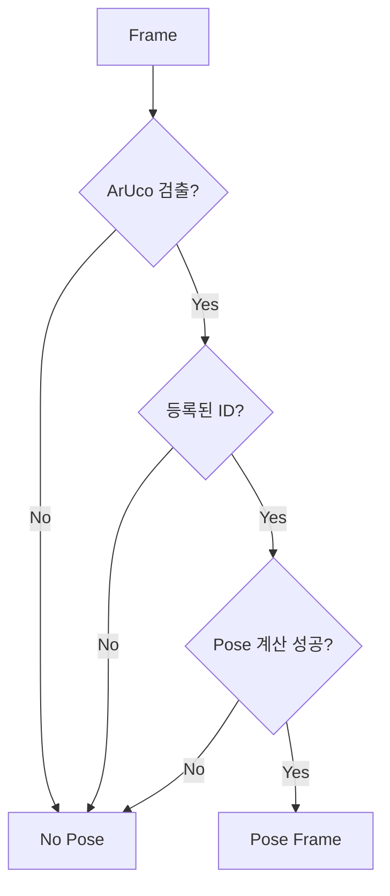

Pose Coverage가 낮다고 해서 반드시 위치추정 알고리즘 자체의 정확도가 낮다는 뜻은 아닙니다.

영상에서 마커가 보이지 않는 시간이 길 경우에도 낮아질 수 있습니다.

---

# 18. 결과 비교

Ground Truth가 없는 경우:
=======
# 모델 / 방법 비교

## 18. Ground Truth 없이 비교
>>>>>>> 0e4e52d (Update map, front door, landmark distance and Z display)

```powershell
python compare_localization_results.py test_results\positions.csv
```

<<<<<<< HEAD
비교 항목:

```text
Pose Coverage
Mean Frame Step
Median Frame Step
P95 Frame Step
```

---

# 19. Ground Truth 기반 평가

Ground Truth CSV:
=======
Ground Truth가 없을 경우 다음과 같은 값을 이용해 결과를 비교할 수 있습니다.

- Pose Coverage
- 프레임 간 위치 변화량
- Mean Step
- Median Step
- P95 Step

> 이동 중인 영상의 프레임 간 변화량은 실제 이동도 포함하므로 순수한 위치 오차와 동일한 값은 아닙니다. 정지 구간의 흔들림 비교에 특히 유용합니다.

---

## 19. Ground Truth 기반 비교

Ground Truth CSV 형식:
>>>>>>> 0e4e52d (Update map, front door, landmark distance and Z display)

```csv
frame,x_mm,y_mm,z_mm
0,19195,2500,1300
1,19195,2500,1300
2,19195,2500,1300
```

실행:

```powershell
python compare_localization_results.py test_results\positions.csv --ground-truth gt.csv
```

<<<<<<< HEAD
평가 항목:
=======
계산 항목:
>>>>>>> 0e4e52d (Update map, front door, landmark distance and Z display)

```text
MAE 3D
RMSE 3D
Median 3D Error
P95 3D Error
MAE XY
RMSE XY
```

---

<<<<<<< HEAD
# 20. 프로젝트 구조
=======
# Pose Frames 해석

## 20. `Pose frames : 127 (14.8%)`

예:

```text
Pose frames : 127 (14.8%)
```

의 의미는 전체 영상 프레임 중 **유효한 위치/자세를 계산할 수 있었던 프레임이 127개이며, 전체의 14.8%라는 뜻**입니다.

Pose 계산 과정:

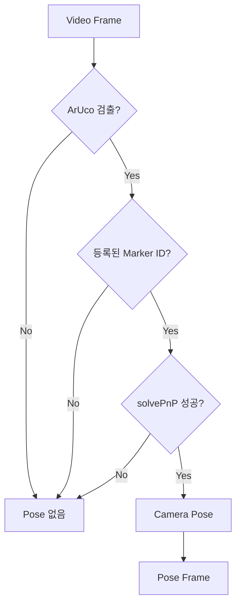

Pose Coverage는 전체 시스템의 한 지표이며, 영상에 마커가 애초에 보이지 않은 구간이 많다면 낮게 나올 수 있습니다.

---

# 프로젝트 구조

## 21. 파일 구성
>>>>>>> 0e4e52d (Update map, front door, landmark distance and Z display)

```text
aruco_indoor_localizer_v2/
├─ aruco_world_map.py
├─ camera_calibration.py
├─ calibrate_webcam.py
├─ check_marker_database.py
├─ coordinate_system.py
├─ live_map_view.py
├─ pose_localizer.py
├─ webcam_localizer.py
├─ video_localizer.py
├─ compare_localization_results.py
├─ requirements.txt
└─ README.md
```

<<<<<<< HEAD
파일 역할:

| 파일 | 역할 |
|---|---|
| `aruco_world_map.py` | Marker ID, 크기, 월드 좌표, FACE/TOP 관리 |
| `camera_calibration.py` | 캘리브레이션 로딩 및 HFOV 근사 카메라 모델 |
| `calibrate_webcam.py` | 체스보드 기반 카메라 캘리브레이션 |
| `check_marker_database.py` | 마커 데이터 검증 |
| `coordinate_system.py` | Landmark 및 주변 위치 판정 |
| `pose_localizer.py` | solvePnP / 좌표 변환 / 다중 마커 융합 |
| `live_map_view.py` | XY 미니맵 |
| `webcam_localizer.py` | 실시간 웹캠 위치추정 |
| `video_localizer.py` | 녹화 영상 위치추정 |
| `compare_localization_results.py` | 위치추정 결과 비교 |

---

# 21. 모듈 관계
=======
각 파일의 역할:

| 파일 | 역할 |
|---|---|
| `aruco_world_map.py` | ArUco ID, 실제 크기, 월드 좌표, FACE/TOP 방향 관리 |
| `camera_calibration.py` | 카메라 내부 파라미터 로딩 및 HFOV 근사 모델 생성 |
| `calibrate_webcam.py` | 체스보드 기반 카메라 캘리브레이션 |
| `check_marker_database.py` | 등록된 마커 데이터 검증 |
| `coordinate_system.py` | 문/랜드마크 좌표 및 주변 판정 |
| `pose_localizer.py` | solvePnP, 월드 좌표 변환, 다중 마커 융합 |
| `live_map_view.py` | 실시간 XY 미니맵 렌더링 |
| `webcam_localizer.py` | 실시간 웹캠 위치 추정 실행 |
| `video_localizer.py` | 녹화 영상 위치 추정 및 결과 저장 |
| `compare_localization_results.py` | 위치 추정 결과 비교 |

---

## 22. 모듈 구조
>>>>>>> 0e4e52d (Update map, front door, landmark distance and Z display)

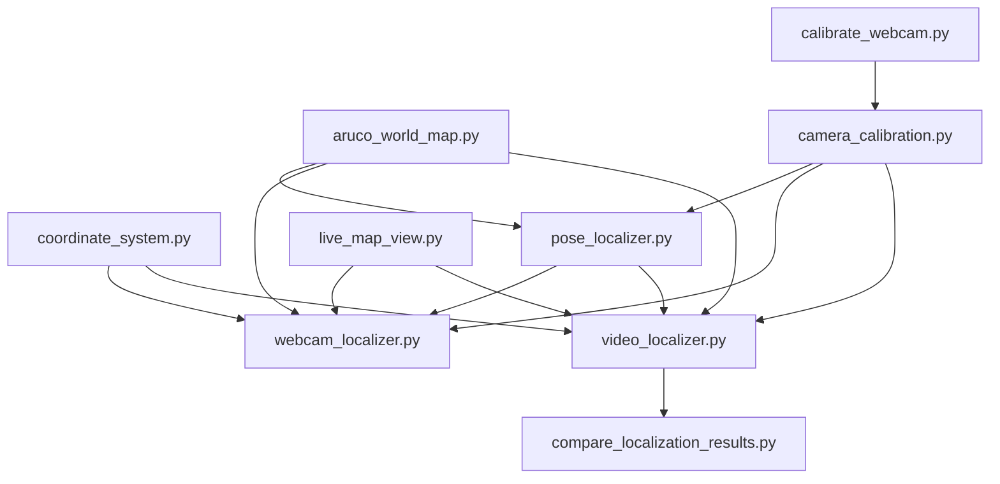

---

<<<<<<< HEAD
# 22. 주요 오차 원인

## 카메라 캘리브레이션

다른 카메라의 캘리브레이션 정보를 사용하면 초점거리와 렌즈 왜곡이 달라 위치 오차가 발생할 수 있습니다.

## Marker 실제 크기

코드에 입력한 `size_mm`와 출력된 실제 마커 크기가 다르면 거리 계산이 틀어질 수 있습니다.

## Marker 방향

`FACE`, `TOP` 정보가 실제 설치 방향과 다르면 월드 좌표 변환 결과가 잘못됩니다.

## Marker 평면 불량

마커가 완전히 평평하게 부착되지 않거나 휘어 있으면 코너 위치가 왜곡되어 `solvePnP` 결과가 불안정해질 수 있습니다.

## Occlusion

장애물에 의해 마커 일부 또는 전체가 가려지면 검출률이 떨어집니다.

## 작은 Marker

34 mm와 같은 작은 마커는 먼 거리에서 픽셀 수가 부족하여 검출과 Pose 계산이 불안정할 수 있습니다.

## 카메라 각도

마커를 매우 비스듬하게 볼 경우 평면 Pose 추정의 오차가 증가할 수 있습니다.

## 조명

반사, 어두운 환경, 모션 블러는 ArUco 검출 성능에 영향을 줄 수 있습니다.

---

# 23. 현재 시스템의 제한사항

```text
ArUco가 보이지 않는 구간에서는 절대 위치 계산 불가

실측/CAD 좌표 자체에 오차가 있으면
위치추정 결과에도 해당 오차가 반영됨

현재 출력 위치는 사용자의 몸 중심이 아니라
카메라 광학 중심 기준

Landmark 주변 판정은 XY 직선거리 기준

장애물을 고려한 실제 이동 경로는 계산하지 않음

근사 HFOV 모드는 직접 캘리브레이션보다
절대 위치 정확도가 낮을 수 있음
=======
# ArUco 데이터 관리

## 23. Marker Database

마커 정보는 `aruco_world_map.py`에서 관리합니다.

각 마커에는 다음 정보가 정의됩니다.

```text
point_name
name
description
marker_id
size_mm
x
y
z
face_world
top_world
```

마커 설치 위치나 방향을 변경한 경우 반드시 데이터베이스 좌표도 함께 수정해야 합니다.

검증:

```powershell
python check_marker_database.py
>>>>>>> 0e4e52d (Update map, front door, landmark distance and Z display)
```

---

<<<<<<< HEAD
# 24. 권장 테스트 시나리오


다음 항목을 비교하기 좋습니다.

```text
위치 정확도
ArUco 검출률
Pose Coverage
프레임 간 흔들림
가중 평균 효과
EMA 효과
Occlusion 영향
작은 Marker 인식 한계
```

---

# 25. 빠른 명령어 모음

### 실시간 실행
=======
# 정확도에 영향을 주는 요소

## 24. 주요 오차 원인

본 시스템의 위치 정확도는 다음 조건에 영향을 받습니다.

### 카메라 캘리브레이션

다른 카메라의 캘리브레이션을 사용할 경우 PnP 결과에 오차가 발생할 수 있습니다.

### 마커 실제 크기

설정한 `size_mm`와 실제 출력된 마커 크기가 다르면 거리 추정 오차가 발생합니다.

### 마커 설치 방향

FACE / TOP 정보가 실제 설치 방향과 다르면 월드 좌표 변환 결과가 잘못됩니다.

### 마커 평면 상태

마커가 구겨지거나 벽에서 들떠 평평하지 않으면 4개 코너의 기하학적 관계가 변형되어 Pose 오차가 증가할 수 있습니다.

### Occlusion

중간 장애물로 마커 일부가 가려지면 검출률과 Pose 안정성이 떨어집니다.

### 작은 마커

34 mm와 같이 작은 마커는 먼 거리에서 픽셀 수가 부족해 검출과 자세 계산이 불안정해질 수 있습니다.

### 카메라와 마커의 각도

마커를 매우 비스듬하게 바라보면 코너 오차와 단일 평면 Pose의 불안정성이 커질 수 있습니다.

### 조명 / 반사

빛 반사, 어두운 환경, 모션 블러는 마커 검출률에 영향을 줍니다.

---

# 시스템 특성 및 제한

## 25. 현재 시스템의 성격

이 프로젝트는 다음과 같은 **전통적 컴퓨터 비전 기반 시스템**입니다.

```text
ArUco Fiducial Marker
        +
Camera Calibration
        +
solvePnP
        +
Coordinate Transform
        +
Multi-Marker Weighted Fusion
```

사용하지 않는 것:

```text
Deep Learning
Machine Learning
Neural Network
Model Training
```

따라서 별도의 학습 데이터나 GPU 학습 과정이 필요하지 않습니다.

---

## 26. 현재 제한사항

- 등록된 ArUco가 보이지 않으면 절대 위치를 계산할 수 없음
- 단일 평면 마커 Pose는 거리와 각도에 따라 노이즈가 발생할 수 있음
- 실측/CAD 기반 월드 좌표 자체에 오차가 있으면 결과에도 반영됨
- 카메라 위치는 사용자의 몸 중심이 아니라 **카메라 광학 중심** 기준
- 랜드마크 주변 판정은 현재 XY 평면 거리 기준
- 경로 거리나 장애물 회피 거리는 계산하지 않음
- HFOV 근사 모드는 직접 캘리브레이션보다 정확도가 낮음

---

# 빠른 실행 요약

## 27. 실시간 위치 추정
>>>>>>> 0e4e52d (Update map, front door, landmark distance and Z display)

```powershell
python webcam_localizer.py --camera 1
```

<<<<<<< HEAD
### 작은 라이브 화면

```powershell
python webcam_localizer.py --camera 1 --preview-width 720 --map-preview-width 650
```

### 카메라 캘리브레이션

```powershell
python calibrate_webcam.py --camera 1
```

### 테스트 영상
=======
카메라 번호 확인:

```powershell
python webcam_localizer.py --list-cameras
```

작은 화면:

```powershell
python webcam_localizer.py --camera 1 --preview-width 720 --map-preview-width 650
```

---

## 28. 카메라 캘리브레이션

```powershell
python calibrate_webcam.py --camera 1
```

---

## 29. 테스트 동영상

동일 카메라 + 정상 캘리브레이션:
>>>>>>> 0e4e52d (Update map, front door, landmark distance and Z display)

```powershell
python video_localizer.py test.mp4 --preview
```

<<<<<<< HEAD
### 장비 불명 영상
=======
촬영 장비 불명:
>>>>>>> 0e4e52d (Update map, front door, landmark distance and Z display)

```powershell
python video_localizer.py test.mp4 --no-calibration --preview
```

<<<<<<< HEAD
### 결과 비교
=======
---

## 30. 결과 비교
>>>>>>> 0e4e52d (Update map, front door, landmark distance and Z display)

```powershell
python compare_localization_results.py test_results\positions.csv
```

<<<<<<< HEAD
### Ground Truth 비교
=======
Ground Truth 포함:
>>>>>>> 0e4e52d (Update map, front door, landmark distance and Z display)

```powershell
python compare_localization_results.py test_results\positions.csv --ground-truth gt.csv
```

---

<<<<<<< HEAD
# 26. System Summary

본 프로젝트는 다음 구조의 전통적 컴퓨터 비전 기반 실내 위치추정 시스템입니다.

```text
Camera
  ↓
ArUco Detection
  ↓
Marker Database
  ↓
solvePnP
  ↓
World Coordinate Transform
  ↓
Multi-Marker Weighted Fusion
  ↓
Camera XYZ + Yaw
  ↓
Live Map / Landmark Decision
```

별도의 학습 데이터나 GPU 기반 모델 학습 과정은 필요하지 않습니다.

# 27. 단면도

본 프로젝트의 월드 좌표계는 `Z`축을 높이 방향으로 사용합니다.

```text
+Z : 바닥 → 천장
-Z : 천장 → 바닥
```

아래 단면도는 마커 설치 높이와 방향을 이해하기 위한 **개략도이며 실제 축척과는 다를 수 있습니다.**

---

## X-Z 단면도

평면도의 X축 방향으로 공간을 잘라서 본 단면입니다.

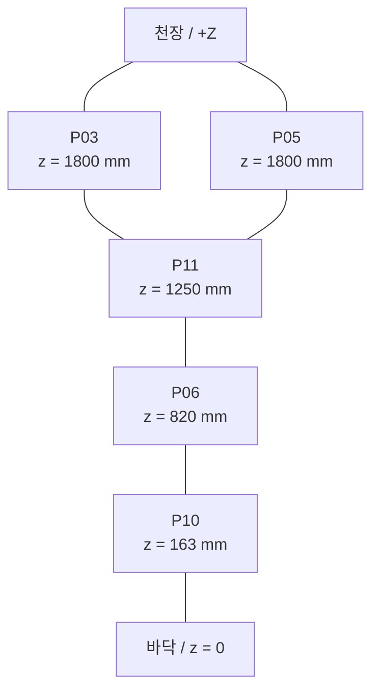

주요 높이:

| Marker | Z 위치 |
|---|---:|
| P03 | 1800 mm |
| P05 | 1800 mm |
| P12 | 1330 mm |
| P11 | 1250 mm |
| P06 | 820 mm |
| P07 | 180 mm |
| P10 | 163 mm |
| P01 / P04 / P08 / P09 | 0 mm |

---

## Y-Z 단면도

Y축 방향에서 공간을 잘라서 본 개략적인 단면입니다.

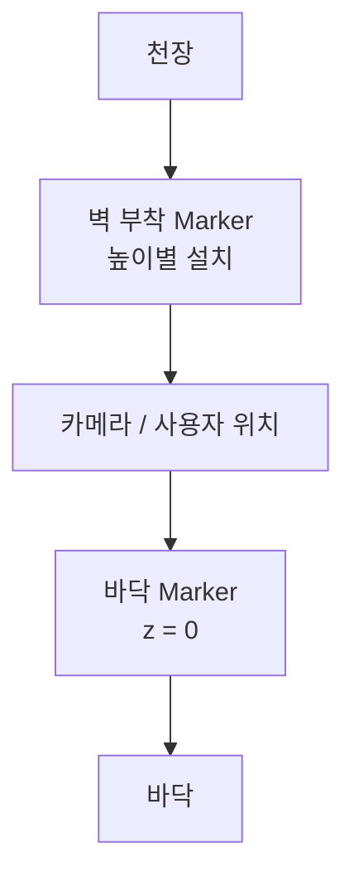

---

## Marker 설치 형태

### 바닥 Marker

```text
        Camera
          ↓
      ┌────────┐
      │ ArUco  │
      └────────┘
──────── Floor ────────

Marker FACE = +Z
```

바닥에 설치된 마커는 카메라가 위쪽에서 바라보도록 배치됩니다.

---

### 벽 Marker

```text
Wall
│
│  ┌────────┐
│  │ ArUco  │ → FACE
│  └────────┘
│
│
└──────────── Floor
```

벽 마커는 복도 방향으로 `FACE`가 향하도록 설치합니다.

마커의 실제 방향은 `aruco_world_map.py`의 다음 값으로 정의됩니다.

```text
face_world
top_world
```

---

## 위치 추정과 단면 관계

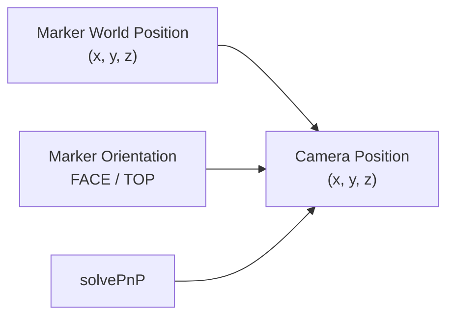

따라서 마커의 평면 위치 `(x, y)`뿐 아니라 **높이 `z`와 설치 방향도 카메라 위치 계산에 직접 사용됩니다.**

</details>
=======
# 권장 테스트 시나리오

모델/방법 비교를 위해 하나의 테스트 영상에 다음 상황을 포함하는 것을 권장합니다.


이렇게 촬영하면 다음 항목을 비교하기 좋습니다.

- 위치 정확도
- 검출률
- Pose Coverage
- 프레임 간 흔들림
- 다중 마커 융합 효과
- 시간축 EMA 효과
- Occlusion 영향
- 작은 마커의 인식 한계

---

## License

팀 프로젝트 정책에 맞는 라이선스를 별도로 지정할 수 있습니다.


</details>


## 동영상 미리보기 처리 방식 선택

### 1. 모든 프레임 분석 — `all`

모든 영상 프레임을 빠짐없이 ArUco/PnP 분석합니다.

```powershell
python video_localizer.py test.mp4 --no-calibration --preview --preview-mode all
```

특징:

```text
모든 프레임 분석
CSV에 모든 처리 프레임 기록
정확한 프레임별 비교에 적합

단점:
한 프레임 처리 시간이 영상 FPS보다 길면
미리보기 재생이 원본보다 느려질 수 있음
```

대기 없이 가능한 최대 속도로 모든 프레임을 분석하려면:

```powershell
python video_localizer.py test.mp4 --no-calibration --preview --preview-mode all --preview-fast
```

### 2. 실제 재생시간 우선 — `realtime`

```powershell
python video_localizer.py test.mp4 --no-calibration --preview --preview-mode realtime
```

특징:

```text
원본 영상 재생시간을 최대한 유지
분석이 느릴 경우 중간 source frame을 자동 skip
현장에서 영상 흐름을 확인하기 좋음

주의:
skip된 프레임은 ArUco/PnP 분석 및 CSV 기록을 하지 않음
따라서 전체 프레임 정밀 비교에는 all 모드를 사용
```

`summary.json`에는 다음 값이 기록됩니다.

```text
settings.preview_mode
video.processed_frames
video.skipped_frames_realtime
video.source_frames_advanced
video.analysis_fraction_of_advanced_frames
```

모델 비교나 정량 평가에는 `all`,
실시간에 가까운 영상 확인에는 `realtime` 사용을 권장합니다.


## 정지 이미지 판정

이미지 한 장에서 ArUco 기반 위치를 판정하려면:

```powershell
python image_localizer.py test.jpg --preview
```

촬영 장비가 불명확하여 기존 캘리브레이션을 사용할 수 없다면:

```powershell
python image_localizer.py test.jpg --no-calibration --preview
```

HFOV를 알고 있다면:

```powershell
python image_localizer.py test.jpg --no-calibration --hfov 70 --preview
```

생성 결과:

```text
test_image_result/
├─ annotated.png
├─ map.png
└─ result.json
```

`annotated.png`에는 검출된 마커, 마커별 위치, Best Single, 다중 마커 융합 위치가 표시됩니다.

`map.png`에는 계산된 현재 위치와 카메라 방향이 XY 미니맵으로 표시됩니다.

`result.json`에는 검출 ID, 등록 ID, 마커별 위치, reprojection error, 가중치, 최종 위치, Yaw, landmark 판정 결과가 저장됩니다.
>>>>>>> 0e4e52d (Update map, front door, landmark distance and Z display)
