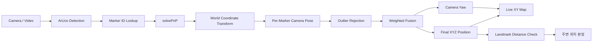
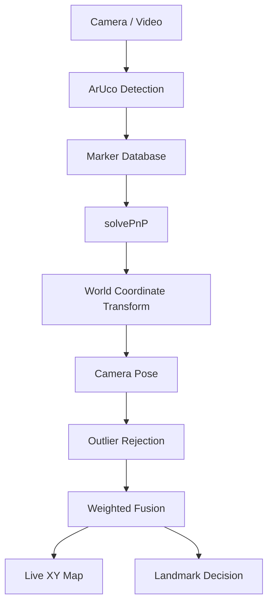
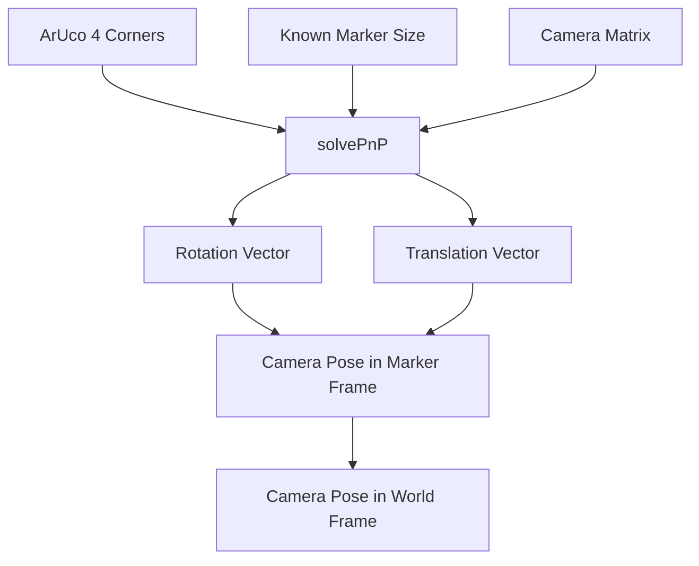
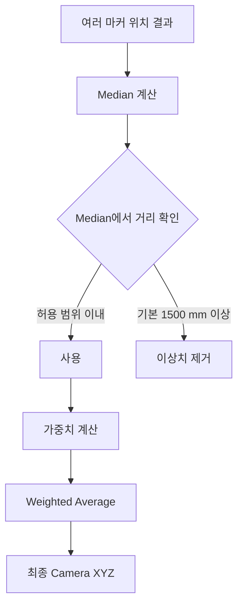
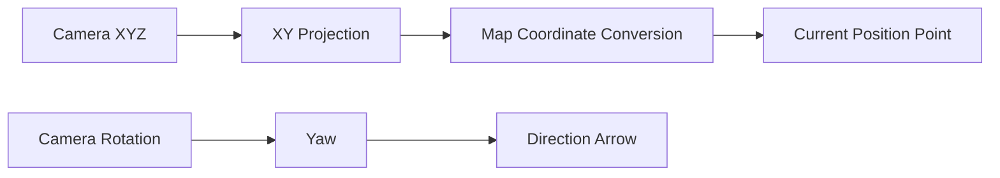
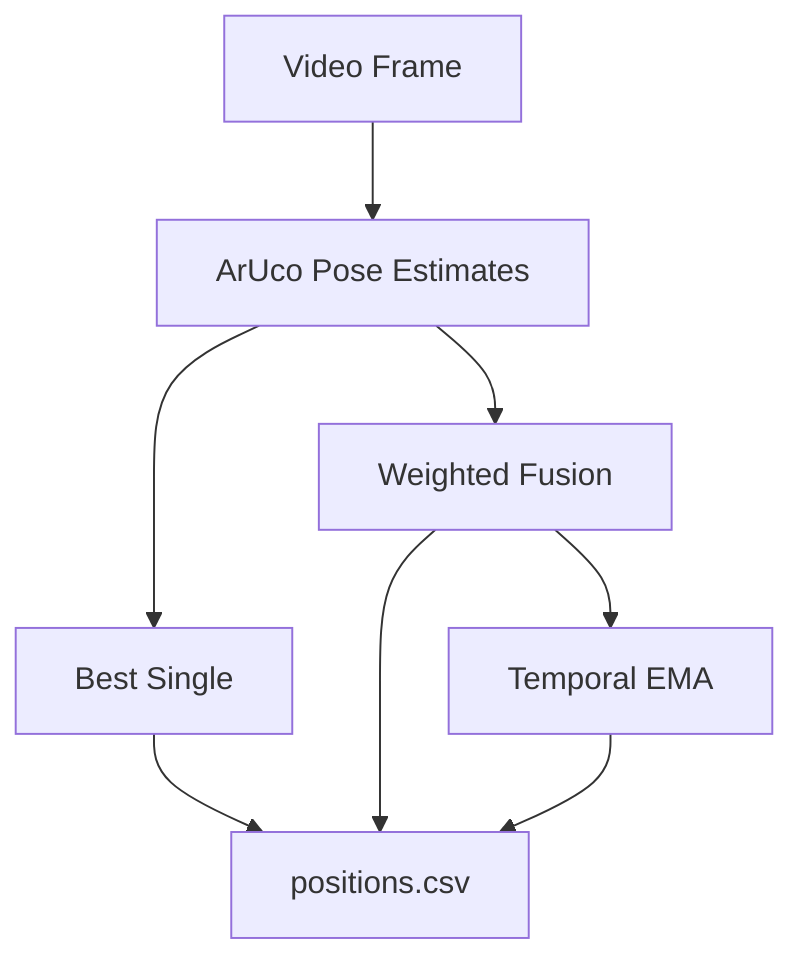
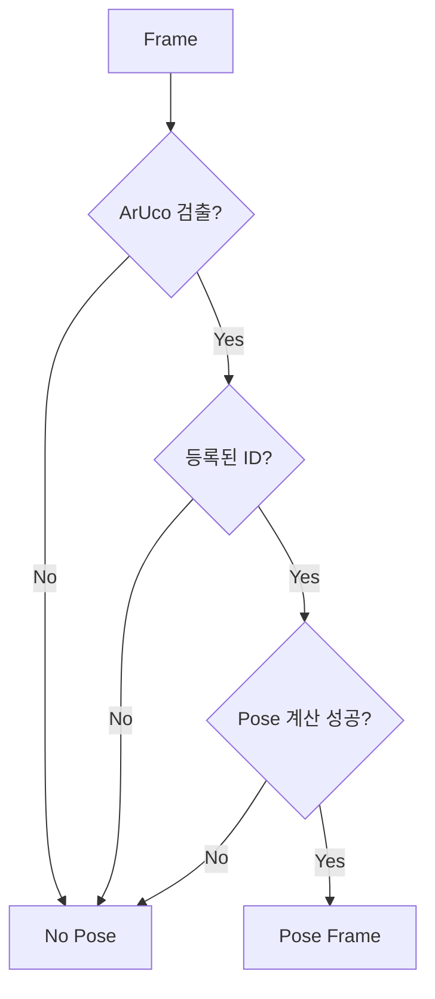
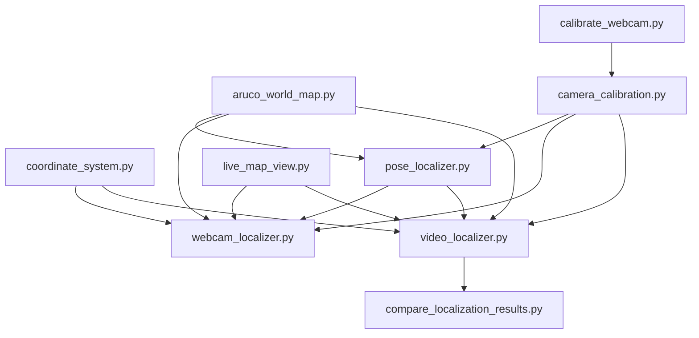

# ArUco Indoor Localizer

<details open>
<summary><strong>📌 요약 보기</strong></summary>

<br>

ArUco 마커와 OpenCV `solvePnP`를 이용하여 실내에서 **카메라의 위치 `(x, y, z)`와 방향을 추정하는 비학습식 실내 위치추정 시스템**입니다.

딥러닝, 머신러닝, 신경망 학습 모델을 사용하지 않고 **ArUco Fiducial Marker + 카메라 기하학 + PnP**를 이용합니다.

## 핵심 기능

- 실시간 웹캠 ArUco 검출
- 마커별 카메라 월드 좌표 계산
- 다중 마커 이상치 제거
- 신뢰도 기반 가중 평균
- 카메라 방향(Yaw) 계산
- 실시간 XY 미니맵
- 문/랜드마크 주변 위치 판정
- 체스보드 기반 카메라 캘리브레이션
- 캘리브레이션이 없는 영상의 HFOV 근사 모드
- 녹화 동영상 위치 판정
- `Best Single / Weighted Fusion / Temporal EMA` 비교
- 결과 영상 / CSV / JSON 저장
- Ground Truth 기반 MAE / RMSE / P95 비교

## 가장 빠른 실행

### 실시간 위치추정

```powershell
python webcam_localizer.py --camera 1
```

### 카메라 번호 확인

```powershell
python webcam_localizer.py --list-cameras
```

### 카메라 캘리브레이션

```powershell
python calibrate_webcam.py --camera 1
```

### 테스트 영상 분석

```powershell
python video_localizer.py test.mp4 --preview
```

### 촬영 장비를 알 수 없는 영상

```powershell
python video_localizer.py test.mp4 --no-calibration --preview
```

### 결과 비교

```powershell
python compare_localization_results.py test_results\positions.csv
```

## 전체 처리 흐름



## 사용 기술

```text
ArUco Fiducial Marker
+
OpenCV
+
Camera Calibration
+
solvePnP
+
Coordinate Transform
+
Multi-Marker Weighted Fusion
```

학습 과정은 사용하지 않습니다.

```text
Deep Learning X
Machine Learning X
Neural Network X
Model Training X
```

> 설치 방법, 좌표계, 가중 평균, 동영상 테스트, 평가 방법 및 프로젝트 구조는 아래의 **자세히 보기**에서 확인할 수 있습니다.

</details>

---

<details>
<summary><strong>📖 자세히 보기</strong></summary>

<br>

# 1. 프로젝트 목적

실내 공간에 설치된 ArUco 마커를 카메라로 인식하고, 각 마커의 실제 월드 좌표와 방향 정보를 이용하여 **현재 카메라의 실내 위치를 추정**합니다.

카메라가 여러 마커를 동시에 인식한 경우 단순 평균이 아니라 각 마커의 신뢰도를 계산하여 위치를 융합합니다.

---

# 2. 시스템 구조



---

# 3. 월드 좌표계

본 프로젝트의 좌표 단위는 **mm**입니다.

```text
+X : 평면도 기준 오른쪽
-X : 평면도 기준 왼쪽

+Y : 평면도 기준 위쪽
-Y : 평면도 기준 아래쪽

+Z : 바닥 → 천장
-Z : 천장 → 바닥
```

마커 좌표계:

```text
local +X = RIGHT
local +Y = TOP
local +Z = FACE
```

마커의 오른쪽 방향은 다음과 같이 계산합니다.

```text
RIGHT = TOP × FACE
```

---

# 4. ArUco Marker Database

각 ArUco 마커에는 다음 정보가 저장됩니다.

```text
point_name
name
description
marker_id
size_mm
x
y
z
face_world
top_world
```

예를 들어 마커의 월드 위치가 다음과 같다면:

```text
x = 19475 mm
y = 6012 mm
z = 1250 mm
```

이는 마커 중심이 해당 월드 좌표에 있다고 가정합니다.

마커 데이터는 다음 파일에서 관리합니다.

```text
aruco_world_map.py
```

데이터 검증:

```powershell
python check_marker_database.py
```

---

# 5. 카메라 위치 추정

카메라가 ArUco 마커를 검출하면 OpenCV의 `solvePnP()`를 사용하여 마커와 카메라 사이의 자세를 계산합니다.



`solvePnP()`의 결과를 역변환한 뒤 마커의 월드 좌표계와 결합하여 최종 카메라 위치를 계산합니다.

---

# 6. 다중 마커 가중 평균

여러 마커가 동시에 보이는 경우 각 마커에서 개별적으로 카메라 위치를 계산합니다.

예:

```text
P03 → Camera Position A
P05 → Camera Position B
P07 → Camera Position C
```

그 다음 이상치를 제거합니다.



기본 가중치는 다음 요소를 사용합니다.

```text
weight ∝ marker_area_px² / reprojection_error_px²
```

즉,

```text
마커가 화면에서 크게 보임
→ 신뢰도 증가

재투영 오차가 작음
→ 신뢰도 증가
```

최종 위치:

```text
Pfinal = Σ(wi × Pi) / Σwi
```

회전행렬은 단순 평균하지 않고 **가중치가 가장 높은 마커의 방향을 대표 방향으로 사용**합니다.

---

# 7. 카메라 캘리브레이션

카메라의 정확한 내부 파라미터를 구하기 위해 체스보드 기반 캘리브레이션을 지원합니다.

실행:

```powershell
python calibrate_webcam.py --camera 1
```

기본 설정:

```text
체스보드 내부 코너 : 9 × 6
정사각형 크기      : 25 mm
권장 해상도        : 1280 × 720
```

조작키:

```text
SPACE : 현재 프레임을 캘리브레이션 샘플로 추가
C     : 캘리브레이션 계산 및 저장
Q     : 종료
```

권장 샘플:

```text
15 ~ 30장
```

결과:

```text
camera_calibration.npz
```

캘리브레이션 샘플:

```text
calibration_samples/
```

캘리브레이션은 다음 요소를 계산합니다.

```text
Camera Matrix
Distortion Coefficients
Image Width
Image Height
RMS Error
```

> 카메라가 변경되거나 렌즈/해상도가 변경되면 다시 캘리브레이션하는 것이 좋습니다.

---

# 8. 실시간 웹캠 실행

카메라 목록 확인:

```powershell
python webcam_localizer.py --list-cameras
```

실행:

```powershell
python webcam_localizer.py --camera 1
```

실시간으로 다음 정보를 표시합니다.

```text
ArUco ID
Marker Name
Camera XYZ
Camera Yaw
사용된 Marker
Position Spread
현재 위치 주변 Landmark
```

---

# 9. 라이브 화면

라이브 실행 시 다음 두 화면을 별도로 표시합니다.

```text
ArUco Indoor Localizer V2
→ 카메라 영상 및 위치 정보

Indoor XY Map
→ 현재 위치 및 실내 미니맵
```

노트북 화면에 맞게 축소:

```powershell
python webcam_localizer.py --camera 1 --preview-width 720 --map-preview-width 650
```

화면 축소는 **표시용 영상에만 적용**됩니다.

ArUco 검출 및 PnP 계산은 원본 프레임을 그대로 사용합니다.

---

# 10. 위치 주변 판정

현재 카메라의 XY 좌표와 등록된 문/랜드마크의 거리를 계산합니다.

기본 기준:

```text
3 m = 3000 mm
```

예:

```text
2번강의실 주변입니다.
```

이 판정은 현재 **XY 평면상의 직선거리**를 기준으로 합니다.

장애물, 실제 이동 경로, Z 높이는 고려하지 않습니다.

---

# 11. 실시간 미니맵

미니맵에는 다음 정보가 표시됩니다.

```text
벽
문
구조물
ArUco 마커 위치
현재 카메라 위치
카메라 방향
사용된 Marker
Position Spread
```

처리 과정:



미니맵 비활성화:

```powershell
python webcam_localizer.py --camera 1 --no-map
```

---

# 12. 캘리브레이션 없는 근사 모드

카메라 캘리브레이션이 없는 경우 근사 카메라 모델을 사용할 수 있습니다.

라이브:

```powershell
python webcam_localizer.py --camera 1 --force-approx
```

기본:

```text
HFOV = 60°
```

직접 설정:

```powershell
python webcam_localizer.py --camera 1 --force-approx --hfov 70
```

이 경우:

```text
영상 크기 → 실제 영상에서 가져옴
HFOV → 사용자 지정 또는 기본 60°
Lens Distortion → 0으로 가정
```

> 근사 모드는 기능 확인에는 사용할 수 있지만 직접 캘리브레이션한 경우보다 절대 위치 정확도가 낮을 수 있습니다.

---

# 13. 테스트 동영상 분석

영상이 프로젝트 폴더에 있다면:

```powershell
python video_localizer.py test.mp4
```

실시간 확인:

```powershell
python video_localizer.py test.mp4 --preview
```

촬영 장비를 알 수 없는 영상:

```powershell
python video_localizer.py test.mp4 --no-calibration --preview
```

HFOV 지정:

```powershell
python video_localizer.py test.mp4 --no-calibration --hfov 70 --preview
```

---

# 14. 동영상 재생 조작

```text
SPACE       : 일시정지 / 재생
N 또는 .    : 다음 프레임 1장
[ 또는 -    : 재생속도 감소
] 또는 +    : 재생속도 증가
R           : 1배속 복귀
S           : 현재 판정 화면 저장
Q / ESC     : 종료
```

지원 속도:

```text
0.125x
0.25x
0.5x
1.0x
1.5x
2.0x
4.0x
8.0x
```

미리보기 크기:

```powershell
python video_localizer.py test.mp4 --no-calibration --preview --preview-width 800
```

---

# 15. 동영상 분석 결과

기본 결과:

```text
test_results/
├─ annotated.mp4
├─ positions.csv
├─ summary.json
└─ snapshots/
```

## annotated.mp4

영상에 다음 정보를 표시합니다.

```text
ArUco ID
Marker별 추정 위치
Best Single
Weighted Fusion
Temporal EMA
Mini Map
```

## positions.csv

프레임별 결과를 저장합니다.

```text
frame
time_sec

detected_ids
registered_ids
used_ids
rejected_ids

best_single_x_mm
best_single_y_mm
best_single_z_mm

fused_x_mm
fused_y_mm
fused_z_mm

ema_x_mm
ema_y_mm
ema_z_mm

yaw_deg
spread_mm
nearest_landmark
nearest_landmark_distance_mm
```

## summary.json

전체 테스트 결과를 요약합니다.

```text
Processed Frames
ArUco Detection Rate
Registered Marker Detection Rate
Pose Coverage
Mean Reprojection Error
Median Reprojection Error
Mean Spread
Median Spread
Marker Frequency
Camera Model Mode
Approximate HFOV
```

---

# 16. 위치 추정 방법 비교

동일한 영상에 대해 세 가지 결과를 동시에 계산합니다.



## Best Single

가장 신뢰도가 높은 단일 마커만 사용합니다.

```text
best_single_x_mm
best_single_y_mm
best_single_z_mm
```

## Weighted Fusion

여러 마커의 위치를 이상치 제거 후 가중 평균합니다.

```text
fused_x_mm
fused_y_mm
fused_z_mm
```

## Temporal EMA

Weighted Fusion 결과를 시간축으로 평활화합니다.

```text
ema_x_mm
ema_y_mm
ema_z_mm
```

기본:

```text
alpha = 0.25
```

변경:

```powershell
python video_localizer.py test.mp4 --ema-alpha 0.4
```

---

# 17. Pose Frames

예:

```text
Pose frames : 127 (14.8%)
```

의 의미:

```text
전체 영상 프레임 중
유효한 카메라 위치/자세를 계산할 수 있었던 프레임 = 127

전체 프레임 대비 비율 = 14.8%
```

처리 흐름:



Pose Coverage가 낮다고 해서 반드시 위치추정 알고리즘 자체의 정확도가 낮다는 뜻은 아닙니다.

영상에서 마커가 보이지 않는 시간이 길 경우에도 낮아질 수 있습니다.

---

# 18. 결과 비교

Ground Truth가 없는 경우:

```powershell
python compare_localization_results.py test_results\positions.csv
```

비교 항목:

```text
Pose Coverage
Mean Frame Step
Median Frame Step
P95 Frame Step
```

---

# 19. Ground Truth 기반 평가

Ground Truth CSV:

```csv
frame,x_mm,y_mm,z_mm
0,19195,2500,1300
1,19195,2500,1300
2,19195,2500,1300
```

실행:

```powershell
python compare_localization_results.py test_results\positions.csv --ground-truth gt.csv
```

평가 항목:

```text
MAE 3D
RMSE 3D
Median 3D Error
P95 3D Error
MAE XY
RMSE XY
```

---

# 20. 프로젝트 구조

```text
aruco_indoor_localizer_v2/
├─ aruco_world_map.py
├─ camera_calibration.py
├─ calibrate_webcam.py
├─ check_marker_database.py
├─ coordinate_system.py
├─ live_map_view.py
├─ pose_localizer.py
├─ webcam_localizer.py
├─ video_localizer.py
├─ compare_localization_results.py
├─ requirements.txt
└─ README.md
```

파일 역할:

| 파일 | 역할 |
|---|---|
| `aruco_world_map.py` | Marker ID, 크기, 월드 좌표, FACE/TOP 관리 |
| `camera_calibration.py` | 캘리브레이션 로딩 및 HFOV 근사 카메라 모델 |
| `calibrate_webcam.py` | 체스보드 기반 카메라 캘리브레이션 |
| `check_marker_database.py` | 마커 데이터 검증 |
| `coordinate_system.py` | Landmark 및 주변 위치 판정 |
| `pose_localizer.py` | solvePnP / 좌표 변환 / 다중 마커 융합 |
| `live_map_view.py` | XY 미니맵 |
| `webcam_localizer.py` | 실시간 웹캠 위치추정 |
| `video_localizer.py` | 녹화 영상 위치추정 |
| `compare_localization_results.py` | 위치추정 결과 비교 |

---

# 21. 모듈 관계



---

# 22. 주요 오차 원인

## 카메라 캘리브레이션

다른 카메라의 캘리브레이션 정보를 사용하면 초점거리와 렌즈 왜곡이 달라 위치 오차가 발생할 수 있습니다.

## Marker 실제 크기

코드에 입력한 `size_mm`와 출력된 실제 마커 크기가 다르면 거리 계산이 틀어질 수 있습니다.

## Marker 방향

`FACE`, `TOP` 정보가 실제 설치 방향과 다르면 월드 좌표 변환 결과가 잘못됩니다.

## Marker 평면 불량

마커가 완전히 평평하게 부착되지 않거나 휘어 있으면 코너 위치가 왜곡되어 `solvePnP` 결과가 불안정해질 수 있습니다.

## Occlusion

장애물에 의해 마커 일부 또는 전체가 가려지면 검출률이 떨어집니다.

## 작은 Marker

34 mm와 같은 작은 마커는 먼 거리에서 픽셀 수가 부족하여 검출과 Pose 계산이 불안정할 수 있습니다.

## 카메라 각도

마커를 매우 비스듬하게 볼 경우 평면 Pose 추정의 오차가 증가할 수 있습니다.

## 조명

반사, 어두운 환경, 모션 블러는 ArUco 검출 성능에 영향을 줄 수 있습니다.

---

# 23. 현재 시스템의 제한사항

```text
ArUco가 보이지 않는 구간에서는 절대 위치 계산 불가

실측/CAD 좌표 자체에 오차가 있으면
위치추정 결과에도 해당 오차가 반영됨

현재 출력 위치는 사용자의 몸 중심이 아니라
카메라 광학 중심 기준

Landmark 주변 판정은 XY 직선거리 기준

장애물을 고려한 실제 이동 경로는 계산하지 않음

근사 HFOV 모드는 직접 캘리브레이션보다
절대 위치 정확도가 낮을 수 있음
```

---

# 24. 권장 테스트 시나리오


다음 항목을 비교하기 좋습니다.

```text
위치 정확도
ArUco 검출률
Pose Coverage
프레임 간 흔들림
가중 평균 효과
EMA 효과
Occlusion 영향
작은 Marker 인식 한계
```

---

# 25. 빠른 명령어 모음

### 실시간 실행

```powershell
python webcam_localizer.py --camera 1
```

### 작은 라이브 화면

```powershell
python webcam_localizer.py --camera 1 --preview-width 720 --map-preview-width 650
```

### 카메라 캘리브레이션

```powershell
python calibrate_webcam.py --camera 1
```

### 테스트 영상

```powershell
python video_localizer.py test.mp4 --preview
```

### 장비 불명 영상

```powershell
python video_localizer.py test.mp4 --no-calibration --preview
```

### 결과 비교

```powershell
python compare_localization_results.py test_results\positions.csv
```

### Ground Truth 비교

```powershell
python compare_localization_results.py test_results\positions.csv --ground-truth gt.csv
```

---

# 26. System Summary

본 프로젝트는 다음 구조의 전통적 컴퓨터 비전 기반 실내 위치추정 시스템입니다.

```text
Camera
  ↓
ArUco Detection
  ↓
Marker Database
  ↓
solvePnP
  ↓
World Coordinate Transform
  ↓
Multi-Marker Weighted Fusion
  ↓
Camera XYZ + Yaw
  ↓
Live Map / Landmark Decision
```

별도의 학습 데이터나 GPU 기반 모델 학습 과정은 필요하지 않습니다.

</details>
